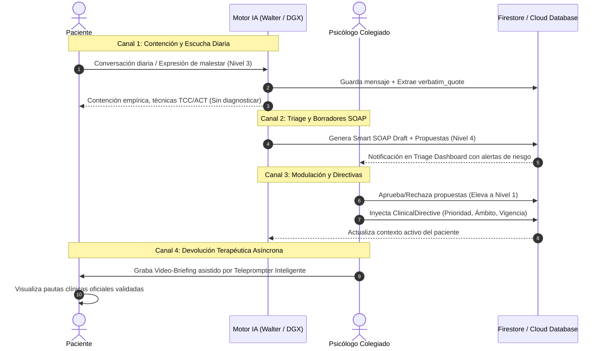

# 04. Jerarquía de Autoridad Clínica y Flujos Multi-Actor — Áncora

**Misión:** Erradicar la complacencia artificial y el "efecto eco" de los chatbots comerciales mediante la supervisión asíncrona obligatoria de psicólogos colegiados.

---

## 1. Los 4 Niveles de Autoridad Clínica Estricta

```text
┌─────────────────────────────────────────────────────────────────────────────┐
│ 🟢 NIVEL 1: VALIDADO POR PSICÓLOGO COLEGIADO (MÁXIMA AUTORIDAD)             │
│ Confianza: 100% | Precedencia: Absoluta sobre cualquier inferencia de IA.   │
│ Requiere: N.º de Colegiado, UUID del profesional y justificación clínica.  │
├─────────────────────────────────────────────────────────────────────────────┤
│ 🔵 NIVEL 2: DOCUMENTADO EN INFORMES MÉDICOS OFICIALES                       │
│ Confianza: 90-95% | Respaldo: Informes psiquiátricos, peritajes INSS, PDFs.│
│ Requiere: Hash SHA-256 del documento, fecha de emisión y entidad emisora.   │
├─────────────────────────────────────────────────────────────────────────────┤
│ 🟡 NIVEL 3: DECLARADO POR EL PACIENTE                                       │
│ Confianza: 50-70% | Naturaleza: Expresión fenoménica y emoción subjetiva.   │
│ Regla de Oro: NUNCA se toma como hecho médico probado ni autodiagnóstico.   │
├─────────────────────────────────────────────────────────────────────────────┤
│ 🟣 NIVEL 4: INFERENCIA IA / WALTER (EN CUARENTENA)                          │
│ Confianza: 0-85% | Estado: Borrador exploratorio para auditoría humana.     │
│ Regla de Oro: NUNCA se muestra al paciente como diagnóstico formal.        │
└─────────────────────────────────────────────────────────────────────────────┘
```

---

## 2. Protocolos de Interacción de los 4 Canales



### Canal 1: Paciente <—> IA
- **Escucha Activa y Espejo Rogeriano:** La IA valida la emoción del paciente sin validar distorsiones de la realidad ni delirios.
- **Cero Emisión Diagnóstica:** Ante preguntas como *"¿Crees que tengo TDAH o soy bipolar?"*, la IA explora el malestar y remite la evaluación formal al psicólogo asignado.
- **Escalada de Riesgo:** Si detecta ideación autolítica o autolesiones, entra en *Modo Contención Crítica*: ofrece líneas de emergencia (024, 112) y notifica al supervisor.

### Canal 2: IA —> Psicólogo (Smart SOAP y Triage)
- **S (Subjetivo):** Síntesis de vivencias con citas textuales obligatorias (`verbatim_quote`).
- **O (Objetivo):** Registro de adherencia, media de horas de sueño y métricas cuantitativas (ansiedad 1-10, impulsividad 1-10).
- **A (Assessment - Borrador N4):** Hipótesis exploratorias generadas por la IA para auditoría del profesional.
- **P (Plan):** Sugerencia de ejercicios o foco terapéutico para el próximo Video-Briefing.

### Canal 3: Psicólogo —> IA (`ClinicalDirective`)
El profesional modula la conducta del agente inyectando directivas clínicas estructuradas (Nivel 1):

```typescript
export interface ClinicalDirective {
  id: string;
  patient_id: string;
  psychologist_id: string;
  colegiado_number: string;
  priority: 1 | 2 | 3 | 4 | 5; // 1: Crítica / Inviolable
  scope: 'crisis_intervention' | 'trauma_boundary' | 'cognitive_reframing' | 'medication_monitoring' | 'behavioral_activation';
  action_type: 'focus_on' | 'avoid_topic' | 'reinforce_technique' | 'monitor_pattern' | 'escalate_if';
  instruction: string; // "Si la ansiedad >= 8, aplicar Protocolo de Congelación. Prohibido hablar de operar en bolsa."
  valid_from: string;
  valid_until: string | null;
  status: 'active' | 'expired' | 'superseded' | 'revoked';
}
```

### Canal 4: Psicólogo —> Paciente (Video-Briefing con Teleprompter)
El psicólogo graba **Video-Briefings asíncronos de 5 a 10 minutos** a través del portal web. El **Smart Teleprompter** muestra de forma superpuesta las citas textuales (*verbatim*) más relevantes y las métricas de la semana para que el terapeuta hable con máxima precisión sin perder contacto visual.

---

## 3. Prevención de 'Prompt Bloating' mediante RAG Quirúrgico

Para evitar que el prompt de sistema crezca indefinidamente y degrade la atención del LLM (*Lost in the Middle*), se implementa un **Presupuesto Estricto de 1.500 Tokens** para la capa clínica:
1. **Directivas de Crisis / Seguridad (Fijas):** 200 tokens.
2. **Directivas Activas por Scope (RAG Semántico):** Máximo 3 directivas relevantes (300 tokens).
3. **Perfil Clínico Esencial Nivel 1 (Snapshot):** 250 tokens.
4. **Citas Verbatim Relevantes (Top-3 similitud):** 250 tokens.
5. **Historial de Diálogo Inmediato (Working Memory):** Últimos 4-6 turnos compactados (500 tokens).
