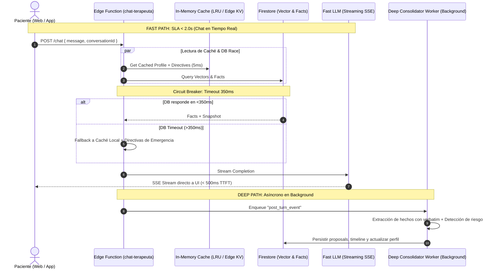

# 05. Working Memory Dinámica, Scoring No Destructivo & Dual Processing

**Módulo:** Inferencia LLM, Context Assembly & Latency Engineering  
**Objetivo:** Respuesta interactiva en tiempo real (<2s), presupuesto elástico de tokens y preservación vitalicia de recuerdos clínicos sin degradación destructiva.

---

## 1. Crítica a la Ventana Fija $W=10$ y Dynamic Context Budgeting

### 1.1 Modos de Fallo de la Ventana Fija $W=k$
- **Asimetría de Densidad:** 10 mensajes de 2 palabras = 20 tokens; 10 volcados de diario = 8.000 tokens.
- **Amnesia Catastrófica de Eventos Ancla (*Anchor Events*):** Un paciente comunica una recaída o sobredosis al inicio de la sesión. Tras 5 intercambios de validación breve ("ok", "entiendo"), la ventana fija $W=10$ expulsa el evento de riesgo del contexto del LLM.

### 1.2 Particionamiento Elástico Presupuestario (en Tokens)

```text
       TOTAL CONTEXT WINDOW ($T_{max}$, ej. 32.768 tokens)
┌─────────────────────────────────────────────────────────────────────────────┐
│ 1. Directivas de Seguridad & System Core ($B_{sys}$)             [Fijo: 12%] │
├─────────────────────────────────────────────────────────────────────────────┤
│ 2. Directivas Clínicas Activas del Psicólogo ($B_{dir}$)         [Fijo: 10%] │
├─────────────────────────────────────────────────────────────────────────────┤
│ 3. Estado Clínico Actual & Metas Activas ($B_{state}$)           [Fijo:  8%] │
├─────────────────────────────────────────────────────────────────────────────┤
│ 4. Memoria Episódica & Hechos Clínicos ($B_{episodic}$)       [Elástico: 25%]│
├─────────────────────────────────────────────────────────────────────────────┤
│ 5. Working Memory Dinámica & Conversación ($B_{wm}$)          [Elástico: 30%]│
├─────────────────────────────────────────────────────────────────────────────┤
│ 6. Reserva de Generación de Salida ($B_{out}$)                [Reservado: 10%]│
├─────────────────────────────────────────────────────────────────────────────┤
│ 7. Margen de Seguridad Anti-Truncamiento ($B_{margin}$)       [Margen:  5%] │
└─────────────────────────────────────────────────────────────────────────────┘
```

Ecuación de balance:
$$B_{available} = T_{max} - \left( B_{out} + B_{margin} + B_{sys} + B_{dir} + B_{state} \right)$$
$$B_{available} = B_{episodic} + B_{wm}$$

---

## 2. Scoring de Relevancia Clínica vs. Decaimiento de Ebbinghaus

### 2.1 Refutación de Ebbinghaus en Contexto Clínico
El olvido de Ebbinghaus ($R = e^{-\Delta t / S}$) asume que la información no mencionada debe desaparecer. En salud mental, **un trauma severo de hace 10 años o una alergia a fármacos no desaparecen**.  
**El recuerdo nunca se borra.** Lo que cambia es su **`retrieval_score`**.

### 2.2 Formulación Matemática del Scoring Multifactorial

$$\boxed{S_{retrieval}(m, q, E_{state}) = \sum_{i=1}^{6} \omega_i \cdot \Phi_i(m, q, E_{state})}$$

| Componente $\Phi_i$ | Peso $\omega_i$ | Descripción y Rango |
| :--- | :---: | :--- |
| **1. $\text{Sim}(q, m)$** (Similitud Semántica) | **0.30** | Coseno normalizado entre embedding de consulta y memoria $[0, 1]$. |
| **2. $I(m)$** (Importancia Intrínseca) | **0.20** | Gravedad clínica tipificada (Riesgo vital = 1.0, Diagnóstico = 0.9, Síntoma leve = 0.5). |
| **3. $CR(m, E_{state})$** (Resonancia de Estado) | **0.20** | Afinidad temática con el vector emocional actual (ansiedad, impulsividad, riesgo). |
| **4. $\text{Rec}(m)$** (Recencia No Destructiva) | **0.10** | Función hiperbólica con **suelo asintótico $\alpha = 0.25$**. |
| **5. $\text{Reinf}(m)$** (Refuerzo Hebbiano) | **0.10** | $\tanh(0.15 \cdot n_{recalls} + 0.50 \cdot n_{validations})$. |
| **6. $\text{Conf}(m)$** (Nivel de Autoridad) | **0.10** | Nivel 1 = 1.00, Nivel 2 = 0.85, Nivel 3 = 0.65, Nivel 4 = 0.40. |

### 2.3 Suelo Asintótico de Recencia ($\alpha = 0.25$)

$$\boxed{\text{Rec}(m, \Delta t) = \alpha + (1 - \alpha) \cdot \frac{1}{1 + \ln\left(1 + \frac{\Delta t}{\tau}\right)}}$$

Con $\alpha = 0.25$ y $\tau = 30$ días, cuando $\Delta t \to \infty$, $\text{Rec}(m) \to 0.25 > 0$. **El recuerdo permanece disponible permanentemente.**

---

## 3. Template de Cero Alucinaciones (`Zero-Hallucination XML`)

```xml
<system_identity>
Eres Walter IA, el asistente de blindaje conductual y soporte clínico de Áncora.
REGLA DE CERO ALUCINACIONES:
- NUNCA afirmes un hecho médico, vital o farmacológico que no esté contenido en <clinical_facts> o <current_state>.
- Toda referencia a eventos pasados DEBE fundamentarse en el identificador [ID: fact_xxx].
</system_identity>

<active_clinical_directives>
- DIRECTIVA-01: Si el nivel de ansiedad >= 8, aplicar Protocolo de Congelación Inversa (sumergir rostro en agua helada 30s). Prohibido aconsejar operar en mercados.
- DIRECTIVA-02: Verificar toma de Atomoxetina antes de iniciar resolución de problemas.
</active_clinical_directives>

<current_clinical_state>
- Ansiedad (1-10): 8/10 [ALERTA ELEVADA] | Impulsividad: 7/10
- Medicación: NO REGISTRADA HOY
</current_clinical_state>

<retrieved_clinical_evidence>
[ID: fact_104] [AUTORIDAD: 1 - Validado Psicólogo] [FECHA: 2026-05-12]
Contenido: Episodio de descompensación tras pérdida de 1.400€ en futuros de BTC.
Cita Textual: "Emilio reporta taquicardia severa y parálisis tras liquidación de cuenta en sesión nocturna."
</retrieved_clinical_evidence>

<working_memory_context>
[Turno 6] [USUARIO]: Me cuesta mucho respirar y estoy pensando en meter un trade rápido para sacar los 200€ que me faltan.
[Turno 7] [ASISTENTE]: Emilio, detén la mano del ratón. Respira hondo. Estás en un pico de ansiedad 8/10 y no has registrado la Atomoxetina de hoy.
</working_memory_context>
```

---

## 4. Tolerancia Absoluta a Fallos: Fast Path (<2s) vs. Deep Path


