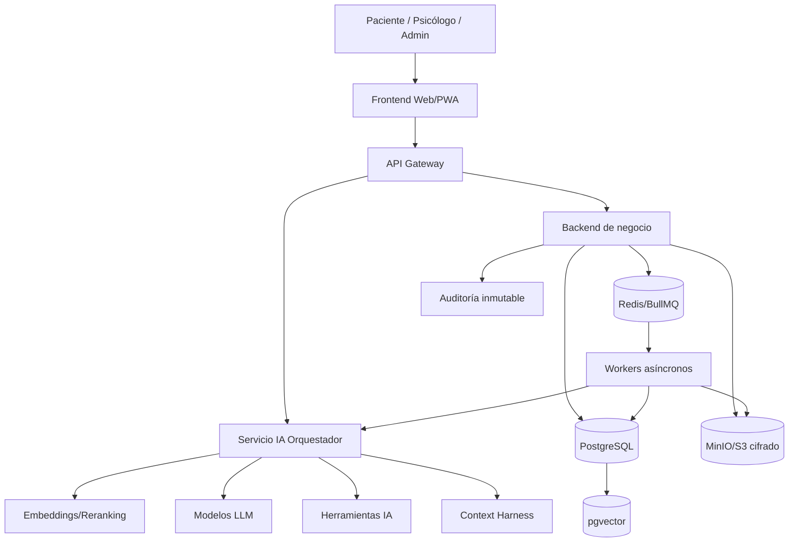
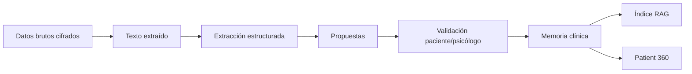
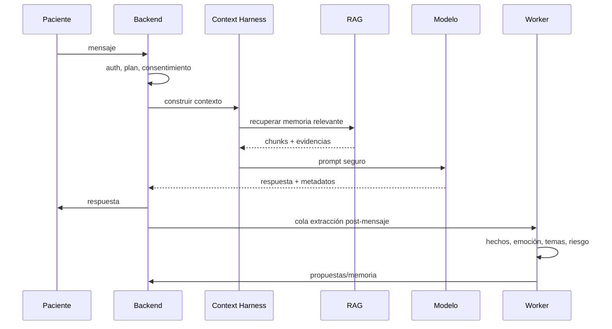
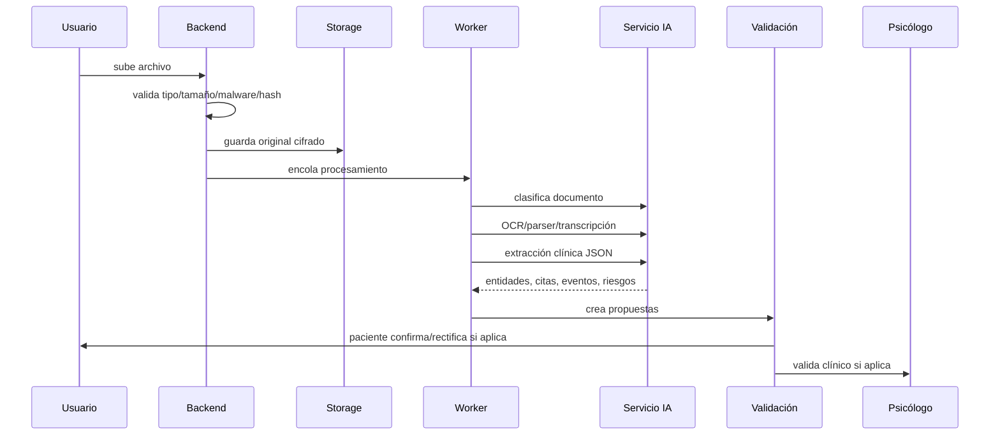
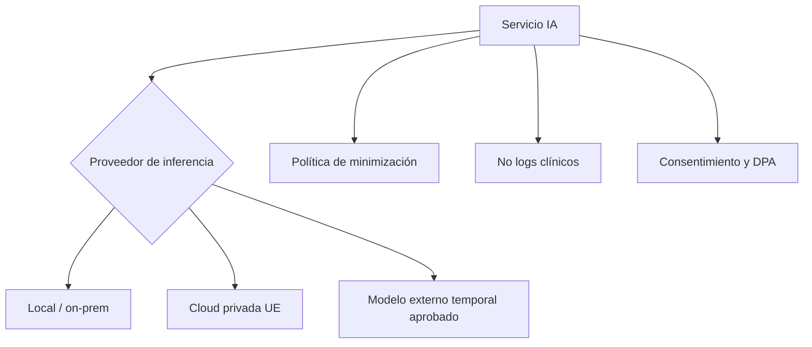

# 02 · Arquitectura backend, IA y almacenamiento

## 1. Principio arquitectónico

El frontend nunca debe llamar directamente al modelo de IA.

Todo debe pasar por un backend inteligente que:

- autentica;
- verifica permisos;
- consulta consentimientos;
- recupera memoria;
- prepara contexto;
- decide herramientas;
- llama modelos;
- valida salidas;
- guarda resultados;
- crea propuestas;
- audita accesos;
- activa protocolos si hay riesgo.

## 2. Vista general

## 3. Servicios principales

### 3.1 API Gateway

Responsabilidades:

- TLS;
- rate limiting;
- protección básica;
- enrutamiento;
- verificación de sesión;
- logging técnico sin contenido clínico.

### 3.2 Backend de negocio

Responsabilidades:

- usuarios;
- roles;
- pacientes;
- psicólogos;
- permisos;
- consentimientos;
- agenda;
- pagos;
- asignaciones;
- documentos;
- sesiones;
- notificaciones;
- auditoría;
- coordinación con el servicio IA.

Tecnología recomendada:

- NestJS/Node.js o equivalente;
- PostgreSQL como base principal;
- Redis/BullMQ para colas;
- MinIO/S3 compatible para ficheros cifrados.

### 3.3 Servicio IA

Responsabilidades:

- context harness;
- RAG;
- extracción JSON;
- clasificación documental;
- resúmenes;
- propuestas de actualización;
- generación de borradores SOAP;
- detección de riesgo;
- reranking;
- prompts versionados;
- control de salida;
- validación de schemas.

Tecnología recomendada:

- FastAPI/Python;
- vLLM o motor de inferencia equivalente;
- adapters para modelos locales o cloud privada;
- Pydantic para esquemas estrictos;
- workers de batch para procesamiento nocturno.

### 3.4 Workers asíncronos

Responsabilidades:

- OCR pesado;
- transcripción de audio;
- extracción post-sesión;
- embeddings;
- resúmenes diarios;
- resúmenes semanales;
- consolidación longitudinal;
- detección de patrones;
- generación de briefings;
- limpieza/deduplicación;
- alertas no inmediatas;
- mantenimiento de índices.

### 3.5 Almacenamiento documental

Debe separar:

- archivo original cifrado;
- texto extraído;
- secciones estructuradas;
- entidades clínicas extraídas;
- propuestas de actualización;
- chunks vectoriales;
- relaciones con timeline;
- auditoría de acceso.

## 4. Capas de datos

## 5. Separación de memoria y modelo

La memoria nunca pertenece al modelo.

El modelo recibe únicamente:

- reglas clínicas;
- perfil mínimo;
- contexto actual;
- fragmentos recuperados;
- tarea concreta;
- formato de salida.

La memoria persistente pertenece a Áncora y debe ser consultable, auditable y corregible.

## 6. Arquitectura por tareas

| Tarea | Tipo | Latencia esperada | Modelo recomendado | Validación |
|---|---|---:|---|---|
| Chat diario | síncrona | baja | conversacional 8B-32B o cloud privada | reglas + seguridad |
| Extracción JSON | asíncrona/síncrona | media | modelo con salida estructurada | schema estricto |
| OCR/transcripción | asíncrona | media | OCR/Whisper local o privado | revisión por confianza |
| Resumen diario | asíncrona | baja/media | 8B-14B | schema |
| Resumen semanal | batch | media/alta | 14B-32B | revisión opcional |
| SOAP | batch/sesión | media | 32B-70B o modelo fuerte | psicólogo |
| Riesgo inmediato | síncrona | muy baja | reglas + clasificador | protocolo |
| RAG | síncrona | baja | embeddings + reranker | filtros |

## 7. Orquestador central + herramientas

La decisión del formulario favorece un **orquestador central con herramientas especializadas**. Esto evita complejidad innecesaria de multiagentes autónomos.

El orquestador decide:

- qué herramienta usar;
- qué memoria recuperar;
- qué prompt versionado aplicar;
- qué nivel de seguridad activar;
- qué salida JSON esperar;
- qué validar;
- qué guardar como propuesta;
- qué escalar al humano.

Herramientas internas:

- `search_patient_memory`;
- `get_patient_core`;
- `get_recent_sessions`;
- `extract_clinical_entities`;
- `classify_document`;
- `create_update_proposal`;
- `generate_session_briefing`;
- `generate_soap_draft`;
- `detect_risk`;
- `validate_json_schema`;
- `write_audit_event`;
- `notify_psychologist`.

## 8. Pipeline de chat diario

## 9. Pipeline de archivo

## 10. Arquitectura agnóstica local/cloud

La documentación debe ser agnóstica pero preparada para privacidad fuerte.

Regla:

- la arquitectura no debe depender de un proveedor concreto;
- los datos clínicos no deben quedar en logs de proveedor;
- el contexto enviado debe ser mínimo;
- todo debe poder migrar a infraestructura local o cloud privada;
- las decisiones técnicas deben conservar la promesa comercial de privacidad.

## 11. Observabilidad sin contenido clínico

Se deben monitorizar:

- latencia;
- errores;
- colas;
- GPU/CPU/RAM;
- número de embeddings;
- fallos OCR;
- validaciones fallidas;
- riesgos detectados;
- coste por tarea;
- tiempo de procesamiento.

No se deben loguear:

- mensajes clínicos completos;
- prompts con datos identificables;
- respuestas completas del modelo;
- documentos extraídos;
- notas SOAP.

## 12. Eventos de auditoría

Toda acción sensible debe registrar:

- `actor_id`;
- `actor_role`;
- `patient_id`;
- `action`;
- `object_type`;
- `object_id`;
- `timestamp`;
- `legal_basis`;
- `consent_snapshot_id`;
- `ip_hash`;
- `user_agent_hash`;
- `reason`;
- `break_glass_flag`.

## 13. Reglas de escalabilidad

Priorizar:

1. cola y procesamiento asíncrono;
2. RAG eficiente;
3. resúmenes multinivel;
4. modelos por tarea;
5. caching de contexto;
6. indexación incremental;
7. idempotencia;
8. trazabilidad.

No escalar mandando todo el historial al prompt.
