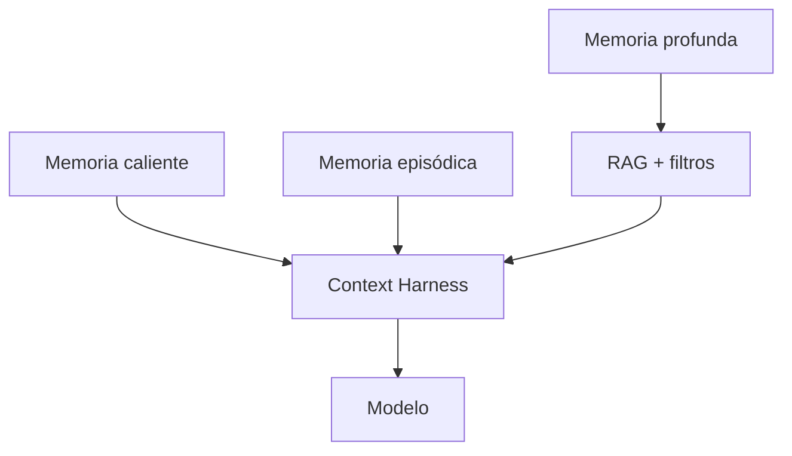
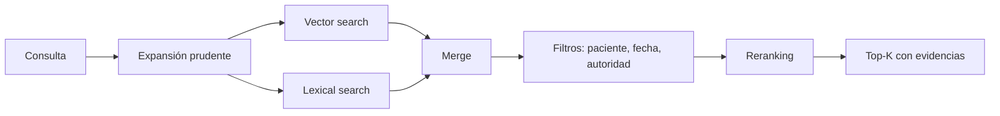

# 03 · Memoria, RAG y Context Harness

## 1. Principio

La memoria es el producto.

Un modelo de IA puede cambiar, mejorar o sustituirse.  
La memoria clínica estructurada de Áncora debe permanecer, evolucionar y ser auditable.

## 2. Tres niveles de memoria



## 3. Memoria caliente

Es el contexto mínimo que debe estar disponible en casi toda interacción.

Contenido:

- identificador del paciente;
- psicólogo asignado;
- estado clínico general;
- riesgos activos;
- consentimientos relevantes;
- objetivos terapéuticos activos;
- medicación relevante declarada/documentada;
- restricciones de seguridad;
- preferencias de comunicación;
- última sesión;
- próxima sesión;
- temas recientes;
- flags legales o de privacidad.

Características:

- pequeña;
- revisada;
- estable;
- versionada;
- no debe crecer sin control.

Formato sugerido:

```json
{
  "patient_id": "uuid",
  "psychologist_id": "uuid",
  "current_status": "seguimiento activo",
  "active_risks": [
    {
      "type": "ideacion_autolitica_pasada",
      "status": "monitorizar",
      "validated_by": "psychologist",
      "last_reviewed_at": "2026-06-10"
    }
  ],
  "active_goals": [
    {
      "goal": "mejorar adherencia a rutinas de sueño",
      "owner": "psychologist",
      "status": "activo"
    }
  ],
  "communication_preferences": {
    "tone": "cálido, directo, sin dramatizar",
    "avoid": ["promesas", "diagnósticos"]
  },
  "safety_boundaries": [
    "no diagnosticar",
    "no prescribir",
    "activar protocolo de crisis si aparece riesgo"
  ]
}
```

## 4. Memoria episódica

Guarda lo reciente y útil para continuidad.

Contenido:

- últimos chats;
- últimos check-ins;
- última sesión;
- revisión semanal;
- tareas recientes;
- eventos recientes;
- cambios de medicación declarados;
- nuevos documentos;
- riesgos detectados;
- temas recurrentes de últimos días.

Uso:

- responder al presente;
- preparar resúmenes;
- detectar cambios;
- alimentar Patient 360;
- generar briefings.

Tablas sugeridas:

- `daily_summaries`;
- `weekly_summaries`;
- `recent_events`;
- `active_tasks`;
- `recent_risk_flags`;
- `session_memory`.

## 5. Memoria profunda

Es el archivo longitudinal completo del paciente.

Contenido:

- cronología vital;
- historia psicológica;
- historia médica;
- medicación;
- documentos;
- sesiones;
- notas SOAP;
- revisiones;
- citas literales;
- relaciones significativas;
- objetivos;
- tareas;
- riesgos;
- patrones;
- hipótesis;
- contradicciones;
- gaps;
- consentimientos;
- auditoría.

La memoria profunda no se mete entera en el prompt.  
Se indexa, se resume y se recupera bajo demanda.

## 6. Tipos de memoria

| Tipo | Ejemplo | Autoridad |
|---|---|---|
| Hecho declarado | “El paciente dice que duerme 4h” | Paciente |
| Hecho documentado | Prescripción subida | Documento |
| Cita literal | “No puedo con otra semana así” | Fuente original |
| Observación profesional | Nota validada por psicólogo | Psicólogo |
| Inferencia IA | posible patrón de evitación | IA, baja autoridad |
| Contradicción | chat dice A, documento dice B | sistema |
| Gap | tema relevante no explorado | sistema/psicólogo |
| Acción | tarea acordada | psicólogo/paciente |

## 7. RAG por paciente

El RAG debe estar aislado por paciente. Ninguna búsqueda debe cruzar pacientes salvo contextos agregados anonimizados y aprobados.

### 7.1 Indexación

Tipos de contenido indexable:

- mensajes de chat chunked;
- resúmenes diarios;
- resúmenes semanales;
- notas de sesión;
- SOAP;
- documentos extraídos;
- eventos de timeline;
- citas literales;
- tareas;
- objetivos;
- observaciones del psicólogo.

Metadatos obligatorios:

```json
{
  "patient_id": "uuid",
  "source_type": "chat|document|session|soap|review|task",
  "source_id": "uuid",
  "date": "2026-06-10",
  "created_at": "2026-06-10T12:00:00Z",
  "authority_level": "psychologist_validated|documented|patient_declared|ai_inferred",
  "validation_status": "pending|patient_confirmed|psychologist_validated|rejected",
  "topics": ["trabajo", "sueño"],
  "emotions": [{"name": "ansiedad", "intensity": 8}],
  "risk_tags": [],
  "consent_scope": "clinical_care",
  "language": "es",
  "evidence_count": 2
}
```

### 7.2 Búsqueda híbrida

No basta con vector search. Debe combinar:

- búsqueda semántica;
- filtros por paciente;
- filtros por fecha;
- filtros por autoridad;
- filtros por tipo de fuente;
- búsqueda lexical para términos clínicos;
- reranking;
- diversidad de fuentes;
- límite de evidencia por fuente.



## 8. Context Harness

El context harness es la pieza que decide qué recibe el modelo.

Debe construir cada llamada con capas:

1. reglas clínicas y límites;
2. tarea concreta;
3. rol del usuario;
4. consentimiento aplicable;
5. perfil mínimo;
6. estado actual;
7. riesgos activos;
8. objetivos activos;
9. memoria episódica;
10. memoria recuperada por RAG;
11. evidencias;
12. instrucciones de salida;
13. formato JSON o texto esperado.

## 9. Presupuesto de contexto

Ejemplo para interacción de chat:

| Bloque | Tokens aproximados |
|---|---:|
| System prompt clínico | 600 |
| Perfil mínimo | 400 |
| Riesgos y consentimientos | 300 |
| Últimos mensajes | 1200 |
| Resumen reciente | 600 |
| RAG top evidencias | 1800 |
| Instrucción tarea | 200 |
| Total | 5100 |

Regla: si falta espacio, reducir RAG, no eliminar límites clínicos.

## 10. Contexto para psicólogo

Para generar briefing pre-sesión:

- última sesión;
- cambios desde última sesión;
- resumen semanal;
- riesgos;
- tareas;
- nuevos documentos;
- citas literales;
- objetivos;
- contradicciones;
- gaps;
- eventos nuevos;
- análisis IA con evidencia.

## 11. Memoria tipo Hermes adaptada

El perfil persistente debe ser modular:

```json
{
  "patient_core_profile": {},
  "clinical_timeline": [],
  "psychological_history": {},
  "medical_history": {},
  "medication_history": [],
  "therapy_goals": [],
  "risk_profile": {},
  "session_memory": [],
  "weekly_reviews": [],
  "psychologist_conclusions": [],
  "documents_index": [],
  "emotion_patterns": {},
  "consent_state": {},
  "safety_events": [],
  "gaps": [],
  "contradictions": [],
  "hypotheses": []
}
```

Cada módulo debe incluir:

- fuente;
- evidencia;
- fecha;
- confianza;
- autoridad;
- validación;
- último cambio;
- quién lo cambió;
- historial.

## 12. Consolidación de memoria

### 12.1 Tras cada mensaje relevante

- clasificar tema;
- detectar emoción;
- detectar riesgo;
- extraer hechos;
- guardar cita si relevante;
- crear propuesta si hay dato nuevo.

### 12.2 Al final del día

- resumen diario;
- eventos nuevos;
- tareas;
- estado emocional;
- posibles contradicciones;
- risk flag;
- embeddings.

### 12.3 Semanalmente

- consolidación de tendencia;
- progreso/estancamiento/retroceso;
- objetivos;
- gaps;
- briefing para psicólogo;
- propuesta de revisión;
- actualización del perfil longitudinal.

### 12.4 Tras sesión

- transcripción/notas;
- citas;
- temas;
- SOAP draft;
- conclusiones del psicólogo;
- actualización de autoridad alta;
- tareas;
- plan;
- resumen para paciente.

## 13. Evitar memoria basura

No todo debe convertirse en memoria persistente.

Criterios para guardar:

- relevancia clínica;
- relación con objetivos;
- novedad;
- recurrencia;
- intensidad emocional;
- riesgo;
- documento fuente;
- validación humana;
- contradicción;
- utilidad futura.

Criterios para no guardar:

- conversación casual sin relevancia;
- repeticiones exactas;
- inferencias débiles;
- datos sensibles irrelevantes;
- detalles de terceros sin necesidad;
- contenido fuera de consentimiento.

## 14. Contradicciones

El sistema debe preservar contradicciones, no resolverlas automáticamente.

Ejemplo:

```json
{
  "contradiction_id": "uuid",
  "topic": "medicación",
  "statement_a": {
    "source": "chat",
    "text": "dice que no toma medicación",
    "authority": "patient_declared",
    "date": "2026-06-01"
  },
  "statement_b": {
    "source": "document",
    "text": "prescripción de Eutirox 75 mcg",
    "authority": "documented",
    "date": "2026-05-20"
  },
  "status": "pending_clarification",
  "suggested_action": "preguntar al paciente si la medicación sigue activa"
}
```

## 15. Gaps

Un gap es información clínicamente útil que falta, se ha evitado o conviene explorar.

Ejemplos:

- antecedente terapéutico incompleto;
- relación familiar mencionada pero no explorada;
- documento de medicación sin fecha de fin;
- evento traumático nombrado de forma indirecta;
- objetivo terapéutico no operacionalizado;
- tarea repetidamente no realizada.

Los gaps deben aparecer al psicólogo como:

- prioridad;
- motivo;
- evidencia;
- número de intentos;
- sugerencia prudente;
- estado.

## 16. Resúmenes multinivel

El sistema debe generar:

| Nivel | Uso | Longitud |
|---|---|---:|
| Microresumen | tarjeta rápida | 1-3 frases |
| Resumen diario | continuidad | 300-600 palabras |
| Resumen semanal | briefing | 600-1200 palabras |
| Resumen de sesión | notas | variable |
| Resumen longitudinal | Patient 360 | actualizado |
| Resumen de crisis | protocolo | mínimo y exacto |

## 17. Regla de oro

Toda memoria clínica debe ser editable, corregible y trazable.  
Un resumen que no permite llegar a la fuente es peligroso.
