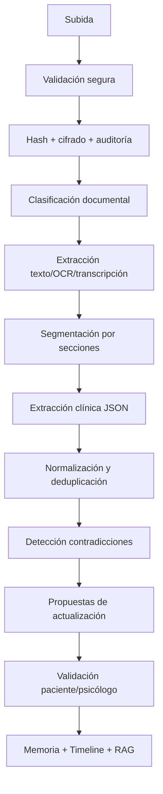
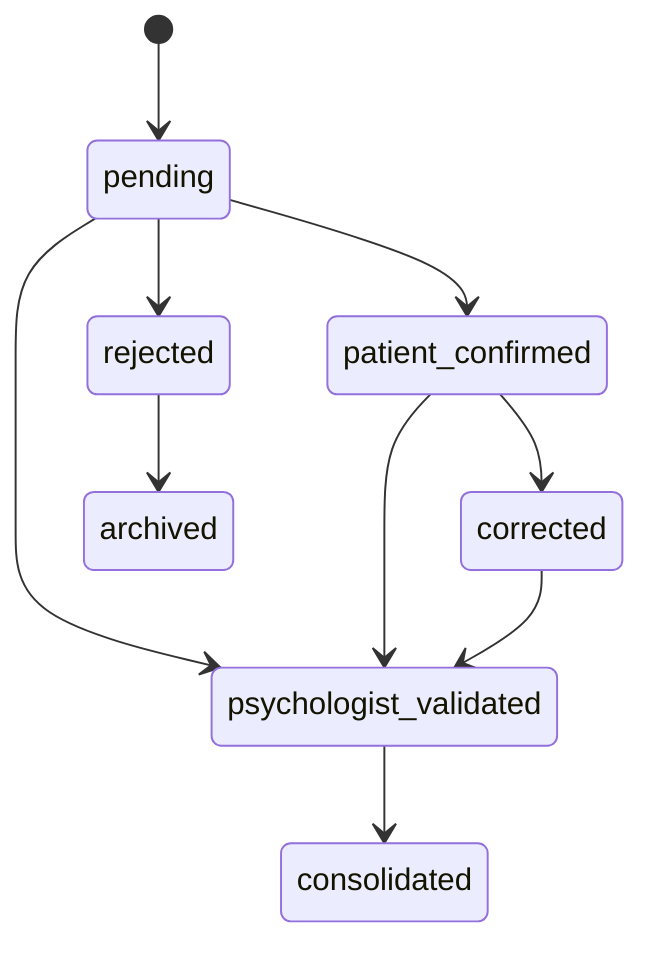

# 04 · Ingesta y extracción clínica desde archivos, chats y sesiones

## 1. Objetivo

El sistema debe convertir archivos, chats, audios y sesiones en datos clínicos estructurados, revisables y útiles.

No basta con almacenar documentos.  
Cada entrada debe alimentar:

- ficha del paciente;
- timeline;
- memoria;
- RAG;
- Patient 360;
- briefing del psicólogo;
- alertas;
- propuestas de actualización.

## 2. Tipos de entrada

| Entrada | MVP | Fase posterior |
|---|---:|---:|
| PDF digital | Sí | Sí |
| Word | Sí | Sí |
| Imágenes / escaneos | Sí, OCR básico | OCR avanzado |
| Audios / notas de voz | Sí, asíncrono | Voz más avanzada |
| Informes médicos | Sí | Sí |
| Informes psicológicos | Sí | Sí |
| Prescripciones | Sí | Sí |
| Analíticas | Sí | parsing tabular |
| Consentimientos | Sí | versionado avanzado |
| Notas personales | Sí | Sí |
| Exportaciones WhatsApp/chat | Fase 2 | Sí |
| Wearables | No prioridad | Fase futura |

## 3. Pipeline de archivo



## 4. Paso 1 · Ingesta segura

Acciones:

- validar extensión;
- validar tamaño;
- validar MIME real;
- escanear malware;
- generar hash;
- guardar original cifrado;
- asociar consentimiento;
- registrar auditoría;
- crear `document_id`;
- encolar procesamiento.

Nunca se debe procesar un archivo sin vínculo claro a paciente, actor y consentimiento.

## 5. Paso 2 · Clasificación documental

Clases iniciales:

- informe psicológico;
- informe psiquiátrico;
- informe médico;
- prescripción;
- medicación;
- analítica;
- consentimiento;
- documento administrativo;
- nota personal;
- audio;
- imagen;
- exportación de chat;
- otro.

Salida:

```json
{
  "document_type": "prescription",
  "confidence": 0.92,
  "language": "es",
  "requires_ocr": false,
  "contains_clinical_data": true,
  "requires_psychologist_validation": true,
  "requires_patient_confirmation": true
}
```

## 6. Paso 3 · Extracción de contenido

Según tipo:

| Tipo | Método |
|---|---|
| PDF digital | extracción nativa |
| PDF escaneado | OCR |
| Imagen | OCR + visión si procede |
| Audio | transcripción |
| Word | parser docx |
| Tabla | parser tabular |
| Chat exportado | parser conversacional |
| Documento largo | secciones + chunks |

Guardar:

- texto limpio;
- texto bruto;
- páginas/secciones;
- confianza OCR;
- coordenadas si hay OCR;
- idioma;
- metadatos.

## 7. Paso 4 · Extracción clínica estructurada

Campos principales:

```json
{
  "dates": [],
  "people": [],
  "life_events": [],
  "psychological_history": [],
  "medical_history": [],
  "medications": [],
  "symptoms": [],
  "diagnoses_documented": [],
  "risks": [],
  "therapy_history": [],
  "recommendations": [],
  "quotes": [],
  "tasks": [],
  "goals": [],
  "contradictions": [],
  "questions_for_patient": [],
  "questions_for_psychologist": []
}
```

## 8. Reglas sobre diagnósticos

Si aparece un diagnóstico en un documento, se guarda como:

- diagnóstico documentado en archivo;
- fecha del documento;
- profesional/centro si aparece;
- fuente;
- cita textual;
- estado de validación.

Nunca como diagnóstico emitido por Áncora.

## 9. Reglas sobre medicación

La IA puede extraer:

- nombre;
- dosis;
- frecuencia;
- vía;
- prescriptor si aparece;
- fecha;
- fuente;
- indicación si aparece;
- estado: activo/declarado/documentado/desconocido.

La IA no puede recomendar cambios.

## 10. Paso 5 · Propuestas de actualización

La IA no debe escribir directamente en la ficha definitiva.

Debe crear propuestas:

- añadir evento a timeline;
- añadir antecedente psicológico;
- añadir antecedente médico;
- añadir medicación;
- añadir documento relevante;
- añadir riesgo;
- añadir cita literal;
- añadir contradicción;
- solicitar aclaración al paciente;
- solicitar validación al psicólogo.

Formato:

```json
{
  "proposal_id": "uuid",
  "patient_id": "uuid",
  "type": "timeline_event",
  "title": "Inicio de tratamiento psicológico por estrés laboral",
  "description": "El informe indica inicio de tratamiento en septiembre de 2024 por estrés laboral.",
  "source": {
    "type": "document",
    "document_id": "uuid",
    "page": 2,
    "quote": "Inicio de tratamiento psicológico en septiembre de 2024 por estrés laboral"
  },
  "authority_level": "documented",
  "confidence": 0.89,
  "requires_patient_confirmation": true,
  "requires_psychologist_validation": false,
  "status": "pending"
}
```

## 11. Validación paciente/psicólogo

### 11.1 Paciente puede validar o rectificar

Apto para:

- datos personales;
- fechas aproximadas;
- medicación que dice tomar;
- eventos vitales;
- relaciones significativas;
- contexto laboral/familiar;
- consentimiento de uso.

### 11.2 Psicólogo debe validar

Obligatorio para:

- interpretación clínica;
- hipótesis;
- objetivos terapéuticos;
- riesgos;
- acciones terapéuticas;
- SOAP;
- conclusiones de evolución;
- recomendaciones clínicas;
- contradicciones críticas.

## 12. Extracción desde chat

Cada mensaje debe pasar por una extracción ligera:

- emoción;
- intensidad;
- tema;
- hechos nuevos;
- citas relevantes;
- riesgos;
- tareas mencionadas;
- contradicciones;
- posible actualización de ficha.

No todo mensaje genera memoria persistente.

## 13. Extracción post-sesión de chat diario

Al cerrar una sesión de chat:

```json
{
  "facts": [
    {
      "text": "El paciente refiere insomnio durante tres noches",
      "source_message_ids": ["uuid"],
      "authority_level": "patient_declared"
    }
  ],
  "dominant_emotion": {
    "name": "ansiedad",
    "intensity": 8
  },
  "topics": ["trabajo", "sueño"],
  "quotes": [
    {
      "text": "No puedo desconectar por la noche",
      "clinical_relevance": "insomnio/rumiación"
    }
  ],
  "risk_level": "low",
  "update_proposals": [],
  "suggested_questions": [
    "Explorar relación entre trabajo y sueño"
  ]
}
```

## 14. Extracción desde sesión con psicólogo

Si hay consentimiento:

- grabación;
- transcripción;
- segmentación;
- citas;
- temas;
- acuerdos;
- tareas;
- cambios de plan;
- riesgos;
- SOAP draft;
- resumen para paciente;
- conclusión validada del psicólogo.

La conclusión del psicólogo tiene autoridad superior a chat y documento para interpretación clínica, pero no borra datos contradictorios: los contextualiza.

## 15. Detección de contradicciones

Tipos:

- medicación contradictoria;
- fechas distintas;
- síntomas negados en chat pero presentes en informe;
- mejora subjetiva vs métricas;
- tarea marcada como hecha pero luego negada;
- consentimiento insuficiente;
- diagnóstico documentado no informado por paciente.

Acción:

- mostrar discrepancia;
- conservar ambas versiones;
- asignar autoridad;
- pedir aclaración;
- escalar al psicólogo si afecta a riesgo o plan.

## 16. Mejora de datos

La mejora de datos incluye:

- limpieza;
- normalización;
- deduplicación;
- unión de eventos;
- fechas aproximadas;
- resolución asistida de contradicciones;
- consolidación de timeline;
- detección de patrones;
- sugerencia de hipótesis;
- control de calidad.

La mejora nunca debe convertir una hipótesis IA en hecho.

## 17. Citas literales

Las citas son esenciales porque dan confianza y evitan análisis opaco.

Guardar citas cuando:

- expresan riesgo;
- expresan creencia central;
- muestran cambio;
- muestran disonancia;
- se repiten;
- son útiles para sesión;
- sustentan una inferencia IA.

Cada cita debe tener:

- texto;
- fuente;
- fecha;
- contexto;
- sensibilidad;
- permiso;
- relación con tema;
- si es mostrable al paciente/psicólogo.

## 18. Calidad de extracción

Cada extracción debe tener:

- confianza;
- campos obligatorios;
- errores;
- advertencias;
- versión de extractor;
- versión de prompt;
- modelo utilizado;
- revisión humana si aplica.

## 19. Estados de una propuesta



## 20. Principio final

El pipeline debe producir menos trabajo, no más.

El psicólogo no debe recibir cien propuestas sin priorizar.  
Debe recibir:

- las más importantes;
- agrupadas;
- con evidencia;
- con nivel de riesgo;
- con acción sugerida;
- con opción de aceptar/corregir/descartar rápido.
