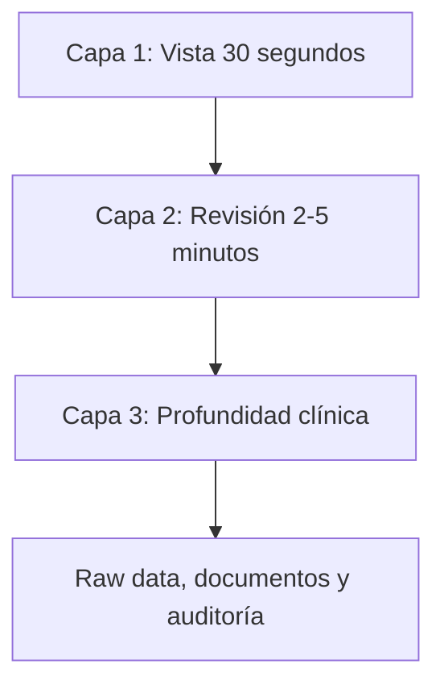

# 05 · Patient 360 y dashboard del psicólogo

## 1. Objetivo

El Patient 360 es la interfaz donde Áncora debe ganar o perder el producto.

Debe permitir que el psicólogo entienda el caso sin leer todo, pero pueda profundizar cuando lo necesite.

La experiencia ideal:

> “Antes de ver a un paciente, reviso todo lo importante en 2 minutos. Si algo me preocupa, puedo abrir la evidencia, citas y documentos en profundidad.”

## 2. Diseño por capas

La decisión del formulario favorece:

- resumen rápido;
- profundidad bajo demanda;
- análisis IA visible pero con citas;
- panel intuitivo y completo.

Diseño recomendado:



## 3. Capa 1 · Vista 30 segundos

Debe mostrar:

- estado general;
- riesgo activo;
- cambio desde última sesión;
- tema dominante;
- próxima sesión;
- tareas críticas;
- nuevo documento relevante;
- alerta si la hay;
- botón “Preparar sesión”.

Ejemplo:

```text
Paciente: Ana M.
Estado: seguimiento activo
Riesgo: sin alerta urgente; monitorizar sueño
Desde última sesión: aumento de ansiedad laboral y peor descanso
Tema principal: anticipación a reuniones
Tarea: registro de pensamientos, 1/3 completado
Nuevo documento: prescripción subida, pendiente de confirmación
Siguiente sesión: jueves 18:00
```

## 4. Capa 2 · Revisión 2-5 minutos

Bloques:

1. Qué ha cambiado.
2. Última sesión.
3. Chats/check-ins recientes.
4. Tareas.
5. Riesgos.
6. Documentos nuevos.
7. Citas literales.
8. Gaps.
9. Propuestas pendientes.
10. Briefing IA con evidencia.

## 5. Capa 3 · Profundidad clínica

Pestañas:

- Resumen longitudinal.
- Timeline vital/terapéutico.
- Datos crudos.
- Sesiones.
- Chats.
- Documentos.
- Medicación.
- Antecedentes.
- Objetivos.
- Tareas.
- Riesgo.
- Patrones.
- SOAP.
- Contradicciones.
- Consentimientos.
- Auditoría clínica.

## 6. Estructura del Patient 360

### 6.1 Cabecera

- nombre;
- edad/rango si procede;
- psicólogo asignado;
- estado;
- plan;
- consentimiento;
- riesgo;
- próxima sesión;
- última revisión;
- botones: preparar sesión, nueva nota, validar propuestas, mensaje, agenda.

### 6.2 Tarjeta “Ahora mismo”

Incluye:

- emoción predominante reciente;
- tendencia;
- nivel de adherencia;
- foco recomendado;
- alerta si procede;
- evidencia breve.

### 6.3 Cambios desde última sesión

Debe comparar:

- emoción;
- temas;
- tareas;
- sueño si existe;
- eventos;
- documentos;
- medicación declarada;
- citas nuevas;
- riesgo.

Formato recomendado:

| Cambio | Evidencia | Estado |
|---|---|---|
| Aumenta ansiedad laboral | 3 check-ins > 7/10 + cita chat | IA con evidencia |
| Tarea incompleta | 1/3 registros realizados | dato estructurado |
| Nuevo documento médico | prescripción subida | pendiente confirmación |

## 7. Análisis con evidencia

Cada análisis IA debe mostrarse como tarjeta:

```text
Patrón posible: ansiedad anticipatoria antes de reuniones
Confianza: media-alta
Evidencia:
- “No voy a dormir antes de la reunión” · chat 14/06
- check-ins ansiedad 8/10 domingo y lunes
- sesión anterior: se acordó exposición gradual
Estado: pendiente de validación clínica
Acciones sugeridas:
- revisar tarea de exposición
- preguntar por sueño previo a reuniones
```

## 8. Timeline vital y terapéutico

Tipos de eventos:

- vital;
- familiar;
- laboral;
- médico;
- psicológico;
- medicación;
- sesión;
- documento;
- riesgo;
- tarea;
- objetivo;
- crisis;
- avance;
- recaída.

Cada evento debe tener:

- fecha exacta o aproximada;
- título;
- descripción;
- fuente;
- autoridad;
- evidencia;
- emoción;
- relación con otros eventos;
- estado de validación.

## 9. Citas literales

Vista específica para citas:

- por fecha;
- por tema;
- por emoción;
- por riesgo;
- por sesión/chat/documento;
- favoritas por psicólogo;
- usadas en briefing.

La cita no debe mostrarse aislada sin contexto.

Campos:

```json
{
  "quote": "No tengo ganas de nada, pero me esfuerzo por sonreír",
  "source_type": "chat",
  "date": "2026-06-12",
  "topic": ["ánimo", "enmascaramiento"],
  "clinical_relevance": "posible disonancia entre estado interno y presentación social",
  "authority_level": "patient_declared",
  "validation_status": "pending"
}
```

## 10. Gaps y temas no explorados

El psicólogo debe ver:

- tema;
- por qué importa;
- evidencia;
- intentos previos;
- sensibilidad;
- sugerencia de abordaje;
- prioridad.

Ejemplo:

```text
Gap: historia de terapia previa incompleta
Motivo: aparece abandono de terapia en informe, pero no se ha explorado qué falló
Evidencia: informe subido 05/06
Sugerencia: preguntar qué necesitaba en aquella terapia y no encontró
Prioridad: media
```

## 11. Propuestas pendientes

Cola de validación:

- por prioridad;
- por tipo;
- por fuente;
- por riesgo;
- por antigüedad.

Acciones rápidas:

- aceptar;
- corregir;
- rechazar;
- pedir al paciente;
- convertir en tarea;
- convertir en tema de sesión;
- posponer.

## 12. Briefing antes de sesión

Debe generarse automáticamente y ser editable.

Estructura:

1. Resumen de 30 segundos.
2. Cambios desde última sesión.
3. Evidencias clave.
4. Riesgos.
5. Tareas.
6. Gaps.
7. Preguntas sugeridas.
8. Posibles focos de sesión.
9. Documentos nuevos.
10. Borrador de nota si procede.

Ejemplo de salida:

```markdown
## Briefing pre-sesión

### Resumen rápido
Desde la última sesión, el paciente muestra aumento de ansiedad vinculada a reuniones laborales y descenso de adherencia a tareas.

### Evidencia
- “Me bloqueo antes de entrar a la reunión” · chat 12/06
- Ansiedad 8/10 en dos check-ins
- Tarea de registro: 1 de 3 completada

### Riesgo
Sin ideación autolítica detectada. Monitorizar sueño.

### Preguntas sugeridas
1. ¿Qué anticipas exactamente antes de la reunión?
2. ¿Qué pasó el día que sí completaste el registro?
3. ¿Qué necesitarías para hacer la tarea más pequeña?
```

## 13. SOAP asistido

La IA genera borrador, el psicólogo valida.

SOAP:

- Subjective: citas y autoinforme;
- Objective: check-ins, tareas, asistencia, sueño si existe;
- Assessment: interpretación clínica del psicólogo, no de IA;
- Plan: tareas, foco, próxima sesión.

Estado:

- draft_ai;
- edited_by_psychologist;
- validated;
- sent_to_patient optional;
- locked/audited.

## 14. Dashboard general del psicólogo

Vista de todos los pacientes:

| Columna | Contenido |
|---|---|
| Paciente | nombre/alias |
| Estado | activo, pendiente, riesgo |
| Próxima sesión | fecha |
| Último contacto | chat/check-in/sesión |
| Alertas | riesgo, documento, tarea |
| Adherencia | tareas/check-ins |
| Revisión pendiente | sí/no |
| Acción | abrir Patient 360 |

Filtros:

- riesgo;
- próxima sesión hoy;
- revisión pendiente;
- nuevos documentos;
- baja adherencia;
- sin contacto;
- alta prioridad;
- plan;
- psicólogo/equipo.

## 15. Vista del paciente

El paciente también necesita orden, pero no debe ver todo el análisis clínico.

Debe ver:

- su progreso;
- sus tareas;
- resúmenes validados;
- documentos;
- consentimientos;
- próximas sesiones;
- diario;
- objetivos acordados;
- mensajes del psicólogo;
- información que puede confirmar/rectificar.

No debe ver:

- hipótesis internas no validadas;
- notas clínicas privadas si no corresponde;
- análisis de riesgo sensible no compartible;
- información de terceros innecesaria.

## 16. Principios UX

- calma visual;
- cero sobrecarga;
- claridad de fuente;
- acciones rápidas;
- evidencias desplegables;
- estados de validación visibles;
- sin gamificación agresiva;
- accesibilidad;
- diseño mobile-first para paciente y desktop-first para psicólogo.

## 17. Estados vacíos

No puede haber pantallas vacías inútiles. Si no hay datos:

- explicar qué falta;
- proponer acción;
- permitir subir documento;
- iniciar check-in;
- invitar paciente;
- generar primera ficha.

## 18. Criterios de aceptación

Un psicólogo debe poder:

- abrir paciente;
- ver resumen útil en 30 segundos;
- ver cambios desde última sesión;
- abrir evidencia en 1 clic;
- validar propuestas rápido;
- generar briefing;
- editar SOAP;
- revisar documentos;
- ver riesgos;
- cerrar revisión.

Si requiere leer todo el chat manualmente, el producto ha fallado.
