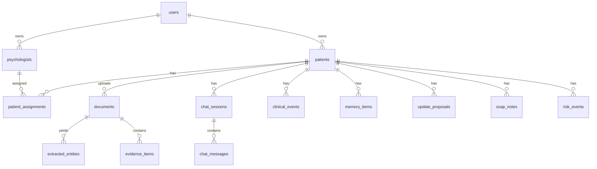

# 06 · Modelo de datos, APIs y eventos

## 1. Principios de modelo de datos

Cada dato clínico debe tener:

- fuente;
- evidencia;
- fecha;
- paciente;
- actor;
- autoridad;
- validación;
- confianza;
- consentimiento;
- auditoría;
- versión;
- historial de cambios.

No diseñar solo tablas de “perfil”. Diseñar un sistema de hechos, evidencias y propuestas.

## 2. Entidades principales



## 3. Usuarios y roles

### `users`

- `id`
- `email`
- `password_hash`
- `role`
- `status`
- `mfa_enabled`
- `created_at`
- `updated_at`

Roles:

- patient;
- psychologist;
- clinic_admin;
- ancora_admin;
- dpo;
- superadmin_technical.

## 4. Pacientes

### `patients`

- `id`
- `user_id`
- `display_name`
- `birth_year`
- `primary_psychologist_id`
- `risk_level_current`
- `status`
- `created_at`
- `updated_at`

No meter toda la ficha en esta tabla. La ficha debe componerse de módulos.

## 5. Psicólogos

### `psychologists`

- `id`
- `user_id`
- `full_name`
- `license_number`
- `qualification_type`
- `verification_status`
- `insurance_status`
- `public_profile_status`
- `created_at`

## 6. Documentos

### `documents`

- `id`
- `patient_id`
- `uploaded_by`
- `original_filename_encrypted`
- `mime_type`
- `size_bytes`
- `sha256_hash`
- `storage_key`
- `document_type`
- `processing_status`
- `contains_clinical_data`
- `consent_snapshot_id`
- `created_at`

### `document_text_sections`

- `id`
- `document_id`
- `section_index`
- `page_start`
- `page_end`
- `text_encrypted`
- `ocr_confidence`
- `language`
- `created_at`

## 7. Evidencias

### `evidence_items`

Una evidencia es una pieza concreta que respalda un dato.

- `id`
- `patient_id`
- `source_type`
- `source_id`
- `locator`
- `quote_encrypted`
- `summary`
- `date_observed`
- `authority_level`
- `sensitivity`
- `created_at`

Ejemplo de `locator`:

```json
{
  "document_id": "uuid",
  "page": 2,
  "paragraph": 4
}
```

## 8. Memoria clínica

### `memory_items`

- `id`
- `patient_id`
- `memory_type`
- `title`
- `content_encrypted`
- `structured_payload`
- `authority_level`
- `validation_status`
- `confidence`
- `source_evidence_ids`
- `valid_from`
- `valid_to`
- `created_by`
- `validated_by`
- `created_at`
- `updated_at`

Tipos:

- core_profile;
- psychological_history;
- medical_history;
- medication;
- therapy_goal;
- risk;
- pattern;
- quote;
- relationship;
- gap;
- contradiction;
- hypothesis;
- task;
- professional_observation.

## 9. Timeline

### `clinical_events`

- `id`
- `patient_id`
- `event_type`
- `title`
- `description_encrypted`
- `event_date`
- `date_precision`
- `emotion`
- `impact`
- `authority_level`
- `validation_status`
- `source_evidence_ids`
- `related_event_ids`
- `created_at`

`date_precision`:

- exact;
- month;
- year;
- approximate;
- unknown.

## 10. Propuestas de actualización

### `update_proposals`

- `id`
- `patient_id`
- `proposal_type`
- `payload`
- `source_evidence_ids`
- `authority_level`
- `confidence`
- `priority`
- `requires_patient_confirmation`
- `requires_psychologist_validation`
- `status`
- `created_by_agent`
- `reviewed_by`
- `reviewed_at`
- `created_at`

Estados:

- pending;
- patient_confirmed;
- patient_corrected;
- psychologist_validated;
- rejected;
- superseded;
- consolidated.

## 11. Chats

### `chat_sessions`

- `id`
- `patient_id`
- `started_at`
- `ended_at`
- `minutes_used`
- `risk_level`
- `summary_status`
- `created_at`

### `chat_messages`

- `id`
- `session_id`
- `sender`
- `encrypted_content`
- `metadata`
- `risk_flag`
- `created_at`

## 12. Resúmenes

### `daily_summaries`

- `id`
- `patient_id`
- `date`
- `summary_encrypted`
- `dominant_emotion`
- `emotion_intensity`
- `topics`
- `risk_flag`
- `source_session_ids`
- `validation_status`
- `created_at`

### `weekly_summaries`

- `id`
- `patient_id`
- `week_start`
- `week_end`
- `summary_encrypted`
- `trend`
- `patterns`
- `briefing_status`
- `created_at`

## 13. Vector chunks

### `vector_chunks`

- `id`
- `patient_id`
- `content_ref_type`
- `content_ref_id`
- `embedding`
- `metadata`
- `content_type`
- `authority_level`
- `validation_status`
- `created_at`

No duplicar contenido sensible en claro si se puede evitar. Guardar referencia cifrada y embedding según evaluación legal/técnica.

## 14. SOAP

### `soap_notes`

- `id`
- `patient_id`
- `psychologist_id`
- `appointment_id`
- `subjective_encrypted`
- `objective_encrypted`
- `assessment_encrypted`
- `plan_encrypted`
- `ai_draft_payload`
- `status`
- `validated_by`
- `validated_at`
- `created_at`

Estados:

- ai_draft;
- edited;
- validated;
- locked;
- archived.

## 15. Riesgo

### `risk_events`

- `id`
- `patient_id`
- `risk_type`
- `severity`
- `detected_by`
- `evidence_ids`
- `protocol_version`
- `actions_taken`
- `notified_psychologist`
- `notified_admin`
- `status`
- `created_at`

## 16. Consentimientos

### `consents`

- `id`
- `user_id`
- `consent_type`
- `version`
- `accepted_at`
- `revoked_at`
- `scope`
- `ip_hash`
- `user_agent_hash`
- `created_at`

Consentimientos separados:

- tratamiento clínico;
- IA para organización;
- IA para resúmenes;
- transcripción de sesiones;
- uso de documentos;
- notificaciones al psicólogo;
- protocolo de crisis;
- marketing;
- investigación/analítica agregada.

## 17. Auditoría

### `audit_events`

- `id`
- `actor_id`
- `actor_role`
- `patient_id`
- `action`
- `object_type`
- `object_id`
- `reason`
- `consent_snapshot_id`
- `break_glass`
- `ip_hash`
- `user_agent_hash`
- `created_at`

## 18. APIs principales

### Crear documento

`POST /patients/{patient_id}/documents`

Respuesta:

```json
{
  "document_id": "uuid",
  "processing_status": "queued"
}
```

### Consultar propuestas

`GET /patients/{patient_id}/update-proposals?status=pending`

### Validar propuesta

`POST /update-proposals/{proposal_id}/validate`

```json
{
  "action": "accept|correct|reject|ask_patient",
  "correction": {},
  "comment": "string"
}
```

### Patient 360

`GET /patients/{patient_id}/patient-360`

Debe devolver:

- capa rápida;
- cambios;
- riesgos;
- tareas;
- propuestas;
- citas;
- documentos;
- timeline resumido;
- links a profundidad.

### Briefing

`POST /patients/{patient_id}/briefings/pre-session`

```json
{
  "appointment_id": "uuid",
  "depth": "quick|standard|deep",
  "include_ai_analysis": true,
  "include_quotes": true
}
```

### RAG interno

`POST /internal/ai/retrieve-context`

```json
{
  "patient_id": "uuid",
  "query": "ansiedad antes de reuniones",
  "task": "pre_session_briefing",
  "filters": {
    "date_from": "2026-06-01",
    "authority_min": "patient_declared"
  },
  "top_k": 8
}
```

## 19. Eventos de dominio

Usar eventos para desacoplar:

- `document.uploaded`;
- `document.text_extracted`;
- `document.entities_extracted`;
- `proposal.created`;
- `proposal.validated`;
- `chat.session_ended`;
- `daily_summary.created`;
- `risk.detected`;
- `soap.draft_created`;
- `soap.validated`;
- `patient360.updated`;
- `consent.revoked`.

## 20. Idempotencia

Todo worker debe ser idempotente.

Ejemplo:

- si se reintenta extracción de documento, no duplicar eventos;
- si se reintenta embedding, actualizar mismo chunk;
- si se reintenta resumen, versionar;
- si se reintenta alerta, no notificar dos veces sin motivo.

## 21. Versionado

Versionar:

- prompts;
- extractores;
- schemas;
- consentimientos;
- protocolos de riesgo;
- modelos IA;
- resúmenes;
- fichas;
- SOAP.

## 22. Migraciones

El modelo debe admitir cambios porque el producto evolucionará.

Recomendación:

- payloads JSONB para extracción flexible;
- tablas fuertes para entidades críticas;
- versiones de schema;
- migraciones controladas;
- tests de regresión de extracción.
