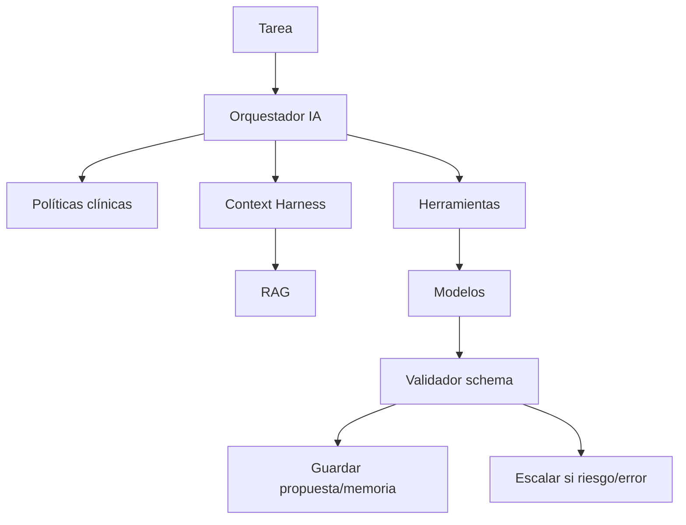

# 07 · Orquestador, herramientas, skills, loops y prompts

## 1. Decisión

Usar **orquestador central + herramientas especializadas**.

No diseñar un sistema de agentes autónomos que tomen decisiones clínicas.  
Diseñar un backend que orquesta tareas deterministas y llamadas IA controladas.

## 2. Orquestador IA

Responsabilidades:

- recibir tarea;
- validar permisos;
- cargar políticas;
- recuperar memoria;
- decidir herramientas;
- construir prompt;
- llamar modelo;
- validar salida;
- crear propuestas;
- auditar;
- escalar a humano si procede.



## 3. Herramientas especializadas

### 3.1 Document tools

- `classify_document`
- `extract_text`
- `segment_document`
- `extract_clinical_entities`
- `detect_document_contradictions`
- `create_document_update_proposals`

### 3.2 Chat tools

- `classify_message`
- `extract_message_facts`
- `detect_message_risk`
- `summarize_chat_session`
- `create_chat_update_proposals`

### 3.3 Memory tools

- `get_hot_memory`
- `get_episodic_memory`
- `search_deep_memory`
- `write_memory_proposal`
- `consolidate_memory`
- `detect_stale_memory`

### 3.4 Psychologist tools

- `generate_patient360_snapshot`
- `generate_pre_session_briefing`
- `generate_soap_draft`
- `suggest_questions`
- `summarize_changes_since_last_session`

### 3.5 Safety tools

- `detect_crisis`
- `apply_crisis_protocol`
- `notify_psychologist`
- `log_safety_event`
- `block_autonomous_clinical_response`

## 4. Skills

Una skill es una rutina repetible, versionada y evaluable.

Ejemplos:

### Skill: extracción de prescripción

Entrada: texto de documento.  
Salida: JSON con medicación, dosis, frecuencia, fuente, confianza, propuesta.

### Skill: briefing pre-sesión

Entrada: paciente + cita.  
Salida: resumen 30s, cambios, evidencias, riesgos, preguntas.

### Skill: detectar gap

Entrada: memoria longitudinal.  
Salida: gaps con prioridad, evidencia y estrategia.

### Skill: resumen semanal

Entrada: 7 daily summaries + sesiones.  
Salida: tendencia, patrones, tareas, cambios, alertas.

### Skill: contradicción clínica

Entrada: dos o más evidencias.  
Salida: contradicción estructurada + acción sugerida.

## 5. Harness loops

Los loops no deben “autoaprender” de forma opaca. Deben ser ciclos controlados.

### 5.1 Loop diario

1. Se cierra sesión de chat.
2. Se extraen hechos.
3. Se genera resumen.
4. Se detecta riesgo.
5. Se crean propuestas.
6. Se encola embedding.
7. Se actualiza memoria episódica.

### 5.2 Loop semanal

1. Consolidar semana.
2. Comparar con semana previa.
3. Detectar progreso/estancamiento/retroceso.
4. Actualizar patrones.
5. Crear briefing.
6. Crear lista de revisión para psicólogo.

### 5.3 Loop documental

1. Nuevo documento.
2. Extracción.
3. Propuestas.
4. Validación.
5. Timeline/RAG.
6. Revisión de contradicciones.

### 5.4 Loop de calidad

1. Muestrear extracciones.
2. Revisar errores.
3. Medir confianza.
4. Ajustar prompts/schemas.
5. Versionar.
6. Reprocesar si procede.

## 6. Prompts versionados

Cada prompt debe tener:

- `prompt_id`;
- versión;
- tarea;
- modelo compatible;
- schema de salida;
- límites clínicos;
- fecha de activación;
- changelog;
- tests.

## 7. System prompt clínico base

Principios:

```text
Eres un asistente de continuidad terapéutica de Áncora.
No eres psicólogo, médico ni terapeuta.
No diagnosticas.
No prescribes.
No sustituyes al profesional humano.
Tu función es acompañar, ordenar, resumir, detectar señales y preparar contexto.
Separa hechos, citas, documentos, inferencias y validaciones.
Cuando haya riesgo de crisis, aplica el protocolo indicado y no mantengas conversación clínica autónoma.
Usa lenguaje claro, cálido y prudente.
No inventes datos.
Si falta evidencia, dilo.
Prioriza datos validados por el psicólogo, después documentados, después declarados, después inferidos.
```

## 8. Prompt de extracción documental

```text
Tarea: extraer información clínica estructurada de un documento.

Reglas:
- No diagnostiques.
- Si aparece un diagnóstico, márcalo como documentado en fuente.
- Extrae solo datos presentes o claramente inferibles.
- Toda inferencia debe marcarse como inferencia.
- Conserva citas literales relevantes.
- Devuelve solo JSON válido según el schema.
- Si hay incertidumbre, usa confidence baja y crea pregunta de aclaración.
```

Schema resumido:

```json
{
  "document_type": "string",
  "entities": {
    "dates": [],
    "medications": [],
    "documented_diagnoses": [],
    "symptoms": [],
    "life_events": [],
    "risks": [],
    "recommendations": [],
    "quotes": []
  },
  "update_proposals": [],
  "contradictions": [],
  "questions": [],
  "confidence": 0.0
}
```

## 9. Prompt de briefing pre-sesión

```text
Tarea: generar briefing pre-sesión para psicólogo.

Debes incluir:
1. Resumen de 30 segundos.
2. Cambios desde última sesión.
3. Evidencia con citas o fuentes.
4. Riesgos activos.
5. Tareas y adherencia.
6. Documentos nuevos.
7. Contradicciones.
8. Gaps.
9. Preguntas sugeridas.
10. Foco posible de sesión.

Reglas:
- No afirmes hipótesis sin evidencia.
- Marca inferencias como inferencias.
- No sustituyas criterio clínico.
- Usa lenguaje profesional y breve.
```

## 10. Prompt SOAP

```text
Genera un borrador SOAP para revisión del psicólogo.

Reglas:
- Borrador, no nota final.
- Subjective: autoinforme y citas.
- Objective: datos observables, check-ins, asistencia, tareas.
- Assessment: formular como "posibles temas a revisar", no diagnóstico.
- Plan: solo tareas/acuerdos ya documentados o sugerencias pendientes de validación.
- Señala huecos de información.
```

## 11. Validación de salidas

Nunca confiar en texto libre para datos clínicos.  
Las salidas estructuradas deben validarse con JSON Schema/Pydantic.

Validaciones:

- campos requeridos;
- tipos;
- rangos;
- citas con fuente;
- no diagnóstico no permitido;
- no recomendación de medicación;
- confidence;
- authority_level;
- validation_status.

## 12. Evaluación de calidad

Crear datasets internos sintéticos/anonimizados para:

- extracción de medicación;
- extracción de timeline;
- detección de riesgo;
- clasificación documental;
- generación de briefing;
- SOAP;
- contradicciones;
- gaps.

Métricas:

- precisión;
- recall;
- tasa de alucinación;
- evidencia presente;
- errores de autoridad;
- errores de seguridad;
- utilidad percibida por psicólogo.

## 13. Fail-safe

Si una herramienta falla:

- no inventar;
- devolver estado parcial;
- crear tarea de revisión;
- informar al usuario si procede;
- registrar error sin contenido clínico;
- no bloquear el uso esencial salvo seguridad.

## 14. No hacer

- agentes autónomos actuando con pacientes sin límites;
- memoria editable directamente por modelo;
- prompts gigantes con toda la historia;
- análisis clínico sin fuentes;
- resúmenes que no permitan auditar;
- decisiones de riesgo solo con LLM;
- acciones clínicas automáticas.

## 15. Hacer

- herramientas pequeñas;
- prompts versionados;
- salida estructurada;
- evidencia obligatoria;
- memoria modular;
- validación humana;
- trazabilidad;
- loops controlados;
- evaluación continua.
