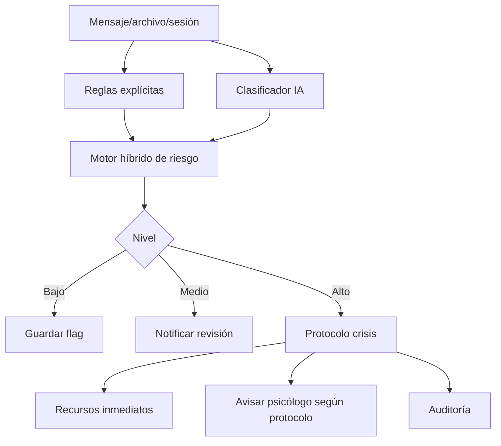

# 08 · Seguridad, privacidad, legal y riesgo clínico

## 1. Principio

Áncora trata datos de salud mental. Debe diseñarse con privacidad, seguridad y prudencia clínica desde el inicio.

No debe añadirse seguridad al final.  
La arquitectura debe nacer con:

- minimización;
- cifrado;
- consentimiento granular;
- roles;
- auditoría;
- control de acceso;
- trazabilidad;
- derecho de acceso/exportación/supresión;
- protocolos de crisis;
- revisión humana.

## 2. Alcance legal

El formulario indica ambición global y cumplimiento de todo lo aplicable.

Para documentación de producto:

- RGPD/UE como base principal;
- LOPDGDD para España;
- ENS/NIS2 si aplica por clientes o contexto;
- HIPAA como posible marco futuro si se entra en EE.UU.;
- revisión legal/DPO obligatoria antes de producción.

## 3. Privacidad como valor comercial

La privacidad debe ser parte del posicionamiento:

- datos bajo control de Áncora;
- minimización de contexto enviado a modelos;
- arquitectura agnóstica local/cloud privada;
- no entrenamiento con datos del paciente;
- logs técnicos sin contenido clínico;
- consentimiento claro;
- exportación y eliminación.

## 4. Consentimiento granular

Consentimientos separados:

| Consentimiento | Obligatorio | Revocable |
|---|---:|---:|
| tratamiento de datos para servicio | Sí | según base legal |
| uso de IA para organizar/resumir | Sí | Sí |
| subida y procesamiento de documentos | Sí | Sí |
| transcripción de sesiones | No | Sí |
| compartir con psicólogo asignado | Sí para servicio | Sí/cambio |
| alertas de riesgo al psicólogo | según protocolo | condicionado |
| uso de datos agregados anonimizados | No | Sí |
| marketing | No | Sí |

## 5. Control de acceso

Roles:

- paciente;
- psicólogo asignado;
- clínica/coordinador;
- admin operativo;
- DPO/compliance;
- superadmin técnico.

Regla:

- nadie ve contenido clínico si no tiene necesidad, permiso y base legal;
- admin técnico no debe ver contenido descifrado;
- acceso break-glass solo con justificación y auditoría reforzada.

## 6. RLS y RBAC

### RBAC

Define qué puede hacer un rol.

### RLS

Asegura en base de datos que solo se accede a filas autorizadas.

Regla: usar ambos.

## 7. Cifrado

Capas:

- TLS en tránsito;
- cifrado en reposo;
- cifrado de objetos/documentos;
- cifrado de campos clínicos sensibles;
- gestión de claves separada;
- rotación;
- posibilidad de crypto-shredding cuando proceda.

## 8. Logs sin contenido clínico

Permitido:

- `request_id`;
- endpoint;
- latencia;
- estado;
- error code;
- actor hash;
- object id;
- tamaño;
- cola;
- modelo;
- versión de prompt.

Prohibido:

- texto de paciente;
- documentos;
- prompts completos;
- respuesta IA completa;
- notas SOAP;
- citas literales.

## 9. Auditoría

Auditar:

- acceso a Patient 360;
- lectura de documento;
- descarga/exportación;
- validación de propuesta;
- creación/modificación SOAP;
- activación de riesgo;
- cambios de consentimiento;
- break-glass;
- eliminación.

## 10. Riesgo y crisis

El formulario favorece:

- depender de consentimiento/protocolo;
- revisión humana;
- sistema híbrido.

Diseño recomendado:

## 11. Niveles de riesgo

| Nivel | Ejemplo | Acción |
|---|---|---|
| Bajo | malestar sin riesgo explícito | seguimiento |
| Medio | desesperanza intensa, insomnio severo, deterioro | revisión psicólogo |
| Alto | ideación suicida, autolesión, violencia | protocolo |
| Crítico | plan, medios, inmediatez | emergencia/protocolo reforzado |

## 12. Respuesta en crisis

La IA no debe continuar como terapeuta.

Debe:

- validar de forma breve y humana;
- no debatir;
- no dar instrucciones peligrosas;
- mostrar recursos de emergencia según país;
- activar protocolo configurado;
- avisar al psicólogo si corresponde;
- registrar evento;
- limitar conversación autónoma.

Texto base:

> Siento que estés pasando por esto. No puedo ayudarte a gestionar una situación de riesgo yo solo desde aquí. Si estás en peligro inmediato o podrías hacerte daño, llama a emergencias de tu país o acude a una persona cercana ahora. Voy a activar el protocolo de apoyo configurado en Áncora.

Debe adaptarse legalmente por país.

## 13. Riesgo de IA terapeuta

Riesgos:

- dependencia emocional;
- complacencia;
- validación de ideas dañinas;
- falsa autoridad;
- retraso en buscar ayuda humana;
- mala gestión de crisis;
- recomendaciones no cualificadas.

Mitigaciones:

- límites visibles;
- IA como apoyo;
- prompts seguros;
- detección de riesgo híbrida;
- revisión humana;
- no diagnosticar;
- no prescribir;
- no prometer curación;
- evidencia y fuentes;
- sesiones humanas como centro.

## 14. Seguridad de modelos

Controles:

- no enviar más contexto del necesario;
- redacción de datos si se usa proveedor externo;
- acuerdos de tratamiento;
- no retención;
- no training;
- evaluación de modelos;
- tests de prompt injection;
- sanitización de documentos;
- detección de instrucciones maliciosas en archivos.

## 15. Prompt injection documental

Los documentos subidos pueden contener instrucciones maliciosas.

Regla:

- tratar documentos como datos, no instrucciones;
- el extractor debe ignorar órdenes dentro del documento;
- separar prompt de contenido;
- validar salida;
- no ejecutar enlaces/código del documento.

## 16. Privacidad en RAG

Problemas:

- embeddings pueden filtrar información;
- índices cruzados pueden mezclar pacientes;
- chunks pueden contener terceros;
- permisos pueden cambiar.

Medidas:

- `patient_id` obligatorio;
- filtros de autorización antes de búsqueda;
- índices separados o namespaces;
- reindexar/eliminar al revocar consentimiento;
- evaluar cifrado/controles de embeddings;
- metadatos de sensibilidad.

## 17. Exportación y supresión

El paciente debe poder solicitar:

- exportación de datos;
- corrección;
- eliminación cuando aplique;
- retirada de consentimientos;
- registro de accesos.

Exportación debe separar:

- datos aportados por paciente;
- documentos;
- resúmenes;
- datos validados;
- notas clínicas sujetas a normativa;
- auditoría disponible.

## 18. Break-glass

Acceso extraordinario:

- solo roles autorizados;
- justificación obligatoria;
- tiempo limitado;
- notificación interna;
- auditoría reforzada;
- revisión posterior.

## 19. Seguridad en UI

- no mostrar contenido sensible en notificaciones push;
- ocultar previews;
- bloqueo de sesión;
- MFA para psicólogos/admins;
- expiración de sesión;
- control de dispositivos;
- descargas protegidas.

## 20. Validación legal

Antes de producción:

- DPA;
- política privacidad;
- términos;
- consentimiento informado;
- evaluación de impacto;
- análisis de proveedores;
- política de brechas;
- protocolo de crisis;
- revisión de claims comerciales;
- revisión de reseñas/marketplace.
