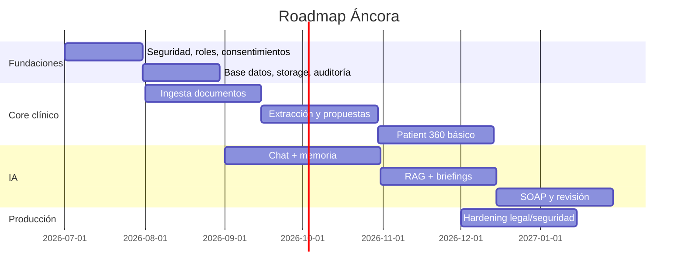

# 09 · Roadmap, MVP y arquitectura target

## 1. Enfoque

El formulario pide un documento ambicioso para guiar todo el producto.  
La recomendación es dividir:

- **Core MVP:** lo mínimo que demuestra el diferencial.
- **V1:** producto sólido para psicólogos y pacientes.
- **V2:** escalado, marketplace avanzado, voz, wearables y enterprise.

## 2. Core no negociable

El primer producto defendible debe incluir:

1. usuario paciente;
2. usuario psicólogo;
3. consentimiento;
4. subida de documentos;
5. extracción clínica estructurada;
6. chat diario básico;
7. memoria por paciente;
8. RAG;
9. Patient 360;
10. propuestas de actualización;
11. briefing pre-sesión;
12. borrador SOAP;
13. riesgo/crisis;
14. auditoría;
15. seguridad.

Sin esto, Áncora sería una app más de chat/telepsicología.

## 3. MVP recomendado

### Fase 0 · Fundaciones

- modelo de roles;
- consentimiento versionado;
- base de datos;
- storage cifrado;
- auditoría;
- permisos;
- arquitectura de colas;
- servicio IA inicial;
- schemas.

### Fase 1 · Documentos y ficha viva

- subida de PDF/Word;
- clasificación documental;
- extracción texto;
- extracción JSON;
- propuestas;
- validación paciente/psicólogo;
- timeline básico;
- memoria inicial;
- documentos relevantes en Patient 360.

### Fase 2 · Chat y memoria

- chat diario texto;
- extracción post-chat;
- resumen diario;
- embeddings;
- RAG por paciente;
- citas literales;
- riesgos básicos;
- contexto en respuestas.

### Fase 3 · Patient 360 psicólogo

- vista 30 segundos;
- cambios desde última sesión;
- tareas;
- citas;
- timeline;
- documentos;
- propuestas;
- briefings;
- filtros de pacientes.

### Fase 4 · Sesiones y SOAP

- agenda básica;
- notas de sesión;
- transcripción si hay consentimiento;
- resumen de sesión;
- SOAP draft;
- validación;
- resumen para paciente.

### Fase 5 · Seguridad y producción

- hardening;
- tests;
- observabilidad;
- backup;
- exportación;
- supresión;
- revisión legal;
- protocolo de crisis;
- panel admin mínimo.

## 4. V1

Añadir:

- notas de voz asíncronas;
- revisión semanal;
- patrones emocionales;
- gaps;
- contradicciones avanzadas;
- dashboards de progreso;
- marketplace controlado;
- pagos;
- perfiles de psicólogos;
- video-briefing;
- plantillas clínicas;
- más tipos de documento.

## 5. V2

Añadir:

- app nativa;
- voz más avanzada;
- wearables;
- integraciones calendario;
- clínicas/equipos;
- permisos compartidos;
- enterprise;
- analítica agregada;
- multilingüe;
- investigación anonimizada;
- modelos locales optimizados.

## 6. Qué dejar secundario

### 6.1 Wearables

No prioridad inicial. Pueden aportar sueño, actividad y HRV, pero complican privacidad, integración y validación.

### 6.2 Hardware doméstico

No debe condicionar el producto. La arquitectura puede soportar local/on-prem, pero la documentación debe ser agnóstica.

### 6.3 Marketplace/reseñas

Importante comercialmente, pero no core clínico. Además, reseñas sanitarias requieren cautela legal.

### 6.4 Voz en tiempo real

Atractiva, pero técnicamente costosa. Para MVP basta texto y notas de voz asíncronas.

### 6.5 App nativa

La PWA puede validar producto. App nativa en fase posterior.

## 7. Backlog priorizado

### P0

- consentimiento;
- seguridad;
- roles;
- paciente/psicólogo;
- documentos;
- extracción;
- propuestas;
- memoria;
- Patient 360 básico;
- riesgo alto;
- auditoría.

### P1

- chat con memoria;
- resumen diario;
- RAG;
- briefing;
- SOAP;
- timeline avanzado;
- validación cómoda.

### P2

- video-briefing;
- pagos;
- marketplace;
- agenda completa;
- analítica;
- notas de voz;
- resúmenes semanales.

### P3

- voz tiempo real;
- wearables;
- enterprise;
- modelos locales 70B;
- research analytics.

## 8. Criterios de aceptación MVP

### Documento

- subir PDF/Word;
- procesar;
- extraer datos;
- generar propuestas;
- validar;
- ver en Patient 360;
- ver evidencia.

### Chat

- responder con contexto;
- guardar mensaje;
- extraer hechos;
- generar resumen;
- detectar riesgo;
- crear memoria.

### Patient 360

- abrir paciente;
- ver resumen;
- ver cambios;
- ver citas;
- ver documentos;
- validar propuesta;
- generar briefing.

### Seguridad

- permisos correctos;
- auditoría;
- logs sin contenido;
- consentimiento;
- exportación básica;
- crisis.

## 9. Riesgos de producto

| Riesgo | Mitigación |
|---|---|
| Construir solo chat | Patient 360 + memoria como core |
| Exceso de automatización clínica | validación humana |
| Psicólogo no confía | evidencia/citas/fuentes |
| Paciente no entiende límites | microcopy claro |
| Demasiadas propuestas | priorización |
| RAG irrelevante | filtros + reranking + evaluación |
| Legal bloquea claims | revisión DPO/legal |
| Coste IA | modelos por tarea + batch |
| Datos sucios | pipeline de validación |

## 10. Roadmap visual

## 11. Decisión final

Primero construir el sistema que hace que el psicólogo diga:

> “Mis pacientes están organizados, entiendo cada caso en dos minutos y no pierdo tiempo buscando información.”

Todo lo demás debe servir a esa frase.
