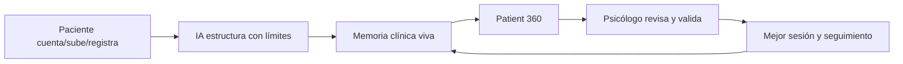

# 11 · Intención de la web y narrativa de producto

## 1. Problema detectado

La versión web actual puede parecer una colección de pantallas: landing, login, dashboard, chat, perfiles, pagos y paneles. Eso no basta. Áncora necesita una **intención de producto única** que conecte toda la experiencia desde la primera visita hasta la revisión clínica del psicólogo.

La web no debe limitarse a “vender terapia online”. Debe explicar y demostrar que Áncora resuelve un problema más profundo:

> La terapia tradicional pierde mucho contexto entre sesiones. Áncora conserva, ordena y convierte ese contexto en memoria clínica útil, siempre supervisada por profesionales humanos.

## 2. Qué quiere hacer Áncora

Áncora quiere ser una plataforma donde:

- el paciente no tenga que repetir su historia una y otra vez;
- los documentos, chats, notas, sesiones y emociones se conviertan en una historia estructurada;
- el psicólogo llegue preparado con contexto claro, verificable y accionable;
- la IA acompañe y organice sin diagnosticar ni sustituir;
- la privacidad sea parte de la promesa central;
- la continuidad terapéutica ocurra también entre sesiones, no solo durante la videollamada.

La web debe vender esta idea en lenguaje simple:

> “Tu terapia no empieza y termina en una sesión. Áncora mantiene el hilo.”

## 3. Intención por tipo de visitante

### 3.1 Visitante paciente

La intención no es que piense “me va a tratar una IA”. La intención es que piense:

- “Aquí puedo encontrar un psicólogo.”
- “Mi historia va a estar ordenada.”
- “No tengo que acordarme de todo antes de cada sesión.”
- “Entre sesiones puedo registrar lo que me pasa.”
- “Mi psicólogo llegará con más contexto.”
- “La IA me ayuda a preparar y ordenar, pero no sustituye al profesional.”

### 3.2 Visitante psicólogo

La intención no es que piense “otra plataforma que me cobra comisión”. La intención es que piense:

- “Me organiza todos mis pacientes.”
- “Me ahorra tiempo antes de cada sesión.”
- “Me prepara resúmenes, citas literales, documentos, riesgo y evolución.”
- “Puedo revisar en 2 minutos lo esencial y profundizar si quiero.”
- “Puedo cobrar mejor y trabajar con menos burocracia.”
- “La IA no decide por mí; me prepara el terreno.”

### 3.3 Clínica o partner

La intención es que vea Áncora como infraestructura:

- continuidad asistencial;
- gestión de pacientes;
- trazabilidad;
- compliance;
- analítica;
- reducción de carga administrativa;
- experiencia premium para pacientes.

## 4. Mensaje principal de la web

### Mensaje base

> Terapia humana con continuidad real, memoria persistente y contexto organizado.

### Submensaje para paciente

> Registra lo que te ocurre entre sesiones, sube documentos y llega a terapia con tu historia mejor ordenada.

### Submensaje para psicólogo

> Revisa cada paciente en minutos: cambios, citas literales, riesgos, documentos, objetivos y borradores SOAP, siempre bajo tu criterio clínico.

### Mensaje de límites

> Áncora no diagnostica, no prescribe y no sustituye a tu psicólogo. La IA acompaña, estructura, resume y alerta.

## 5. Qué debe transmitir la landing en 10 segundos

1. Esto es terapia humana, no psicólogo IA.
2. La diferencia es la continuidad entre sesiones.
3. El paciente tiene diario, chat guiado, documentos e historia organizada.
4. El psicólogo tiene un panel que le ahorra tiempo y mejora contexto.
5. La privacidad y el control de datos son centrales.
6. Puedes empezar como paciente o como psicólogo.

## 6. Qué debe corregirse en una web incompleta

Una web fallida de Áncora suele cometer estos errores:

- mostrar pantallas sin explicar el concepto;
- vender “IA” antes que continuidad terapéutica;
- ocultar el papel del psicólogo humano;
- tener chat sin memoria real;
- tener historial y cronología vacíos;
- no mostrar el flujo completo paciente → IA → memoria → psicólogo;
- no explicar cómo se usan documentos y conversaciones;
- no separar paciente, psicólogo, clínica y admin;
- no mostrar el ahorro real para el psicólogo;
- no diferenciar datos crudos, análisis IA y validación profesional.

## 7. Arquitectura narrativa de la web pública

La web pública debe tener esta secuencia:

1. **Hero:** “La terapia con continuidad real.”
2. **Problema:** entre sesiones se pierde contexto.
3. **Solución:** diario + documentos + memoria + revisión humana.
4. **Para pacientes:** sentirse acompañado y llegar preparado.
5. **Para psicólogos:** menos carga, más contexto, mejor preparación.
6. **Cómo funciona:** registra, estructura, valida, revisa, avanza.
7. **Marketplace:** elige psicólogo verificado.
8. **Demo de Patient 360:** qué ve el psicólogo antes de sesión.
9. **Seguridad:** privacidad, consentimiento, límites IA, crisis.
10. **Planes:** no vender más IA; vender más continuidad y revisión.
11. **CTA:** empezar como paciente / unirse como psicólogo.

## 8. Frases de posicionamiento recomendadas

- “Áncora mantiene el hilo de tu proceso terapéutico.”
- “No es una IA psicóloga. Es memoria, seguimiento y contexto para tu terapia.”
- “Lo importante no se pierde entre sesiones.”
- “Tu psicólogo ve lo esencial en minutos, con fuentes y citas.”
- “La IA organiza. El profesional decide.”
- “Más continuidad para pacientes. Menos carga administrativa para psicólogos.”
- “Privacidad, memoria persistente y acompañamiento supervisado.”

## 9. Frases a evitar

- “Psicólogo IA.”
- “Terapia automática.”
- “Diagnóstico instantáneo.”
- “Cura la ansiedad.”
- “Sustituye a tu terapeuta.”
- “Chat terapéutico ilimitado.”
- “Resultados garantizados.”
- “IA clínica autónoma.”

## 10. Intención final

La web debe conseguir que el usuario entienda que Áncora no es una suma de funcionalidades. Es un sistema completo:

La intención es que cada visitante entienda una promesa simple:

> “Áncora hace que la terapia tenga memoria.”
