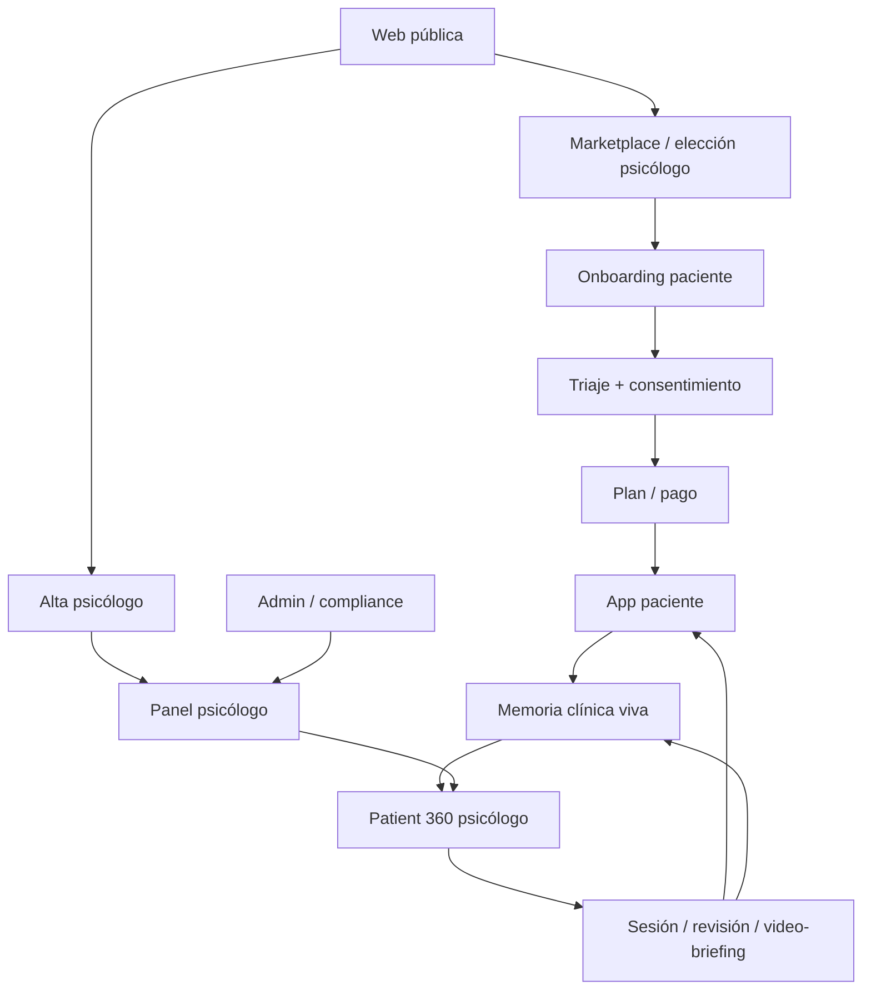

# 12 · Mapa completo de la web, producto y experiencia end-to-end

## 1. Objetivo

Este documento define la estructura completa de la web y la aplicación. Sirve para que desarrollo, diseño y producto entiendan qué debe existir, para quién, con qué intención y cómo se conectan las pantallas.

Áncora debe diseñarse como un recorrido continuo:

## 2. Áreas principales

| Área | Usuario | Intención |
|---|---|---|
| Web pública | Visitante | Entender, confiar y elegir ruta |
| Marketplace | Paciente | Encontrar psicólogo verificado |
| Onboarding paciente | Paciente | Crear cuenta, consentimiento, triaje, pago |
| App paciente | Paciente | Registrar, chatear, revisar historia, reservar |
| Panel psicólogo | Psicólogo | Gestionar pacientes, revisar, validar y ahorrar tiempo |
| Patient 360 | Psicólogo | Ver todo lo importante del paciente en capas |
| Admin | Equipo Áncora | Verificar, auditar, operar y dar soporte |
| Backend IA invisible | Sistema | Extraer, memorizar, analizar, alertar y preparar contexto |

## 3. Web pública

### 3.1 Home

Debe responder en segundos:

- qué es Áncora;
- por qué no es una IA terapeuta;
- qué gana el paciente;
- qué gana el psicólogo;
- cómo funciona;
- por qué confiar;
- cómo empezar.

Bloques recomendados:

1. Hero.
2. Trust strip.
3. Problema: la terapia pierde contexto entre sesiones.
4. Solución: memoria clínica viva.
5. Para pacientes.
6. Para psicólogos.
7. Cómo funciona.
8. Demo visual de Patient 360.
9. Marketplace destacado.
10. Seguridad y privacidad.
11. Planes.
12. FAQ.
13. CTA final.

### 3.2 Página “Para pacientes”

Objetivo: explicar sin miedo ni tecnicismos.

Contenido:

- diario emocional guiado;
- chat diario con límites;
- subida de documentos;
- historia organizada;
- preparación de sesión;
- privacidad y consentimiento;
- elección de psicólogo;
- qué ocurre en crisis;
- qué ve el psicólogo y qué no.

### 3.3 Página “Para psicólogos”

Objetivo: vender ahorro real de tiempo y mejor organización.

Contenido:

- dashboard de pacientes;
- Patient 360;
- revisión en 2 minutos;
- citas literales;
- documentos procesados;
- Smart SOAP;
- agenda y pagos;
- perfil público;
- traer pacientes propios;
- límites y control profesional.

### 3.4 Página “Cómo funciona”

Debe enseñar el flujo:

1. El paciente registra o sube información.
2. La IA extrae y ordena.
3. El paciente puede rectificar.
4. El psicólogo valida lo clínico.
5. La memoria se actualiza.
6. Antes de cada sesión se genera briefing.
7. Después de sesión se actualizan objetivos y SOAP.

### 3.5 Página “Seguridad”

Contenido:

- privacidad por diseño;
- cifrado;
- consentimiento granular;
- control de datos;
- exportación y supresión;
- logs sin contenido clínico;
- break-glass auditado;
- IA supervisada;
- no entrenamiento con datos clínicos sin base legal explícita;
- protocolo de crisis.

## 4. Marketplace / directorio

### 4.1 Intención

Debe dar confianza rápida. El usuario quiere ver personas reales, credenciales, especialidad y disponibilidad.

### 4.2 Elementos

- buscador por motivo no diagnóstico: “estrés laboral”, “pareja”, “autoestima”;
- filtros por especialidad, enfoque, idioma, modalidad, precio, disponibilidad;
- tarjetas con foto, nombre, colegiación, especialidades, disponibilidad, precio y rating de experiencia de servicio;
- ficha pública del psicólogo;
- botón reservar onboarding;
- nota legal: las valoraciones no miden resultados clínicos.

## 5. Onboarding paciente

### 5.1 Pasos

1. Cuenta.
2. Consentimiento.
3. Motivo de consulta.
4. Triaje inicial.
5. Estado de riesgo.
6. Elección o confirmación de psicólogo.
7. Plan y pago.
8. Primera subida de documentos.
9. Primera semana de diario guiado.
10. Sesión inicial / onboarding clínico.

### 5.2 Pantallas mínimas

- Bienvenida.
- Consentimientos.
- Datos básicos.
- Motivo de consulta.
- Triaje.
- Crisis si aplica.
- Psicólogo.
- Plan.
- Privacidad.
- Primera entrada de diario.

## 6. App paciente

### 6.1 Home Hoy

Debe mostrar:

- estado del día;
- botón chat/diario;
- próxima sesión;
- psicólogo asignado;
- tareas pendientes;
- último resumen;
- documentos pendientes de validar;
- botón crisis visible;
- privacidad/control de datos.

### 6.2 Chat diario guiado

Debe incluir:

- aviso “no sustituye al psicólogo”;
- temporizador o límite según plan;
- botones de check-in;
- posibilidad de nota de voz asíncrona;
- cierre con resumen del día;
- extracción automática de hechos, emoción, temas, citas y riesgos;
- propuesta de actualización si aparece información nueva.

### 6.3 Mi Historia

Debe incluir:

- timeline vital y terapéutico;
- antecedentes;
- medicación;
- documentos;
- objetivos;
- evolución;
- datos validados, documentados, declarados e inferidos;
- opción de rectificar o comentar datos.

### 6.4 Documentos

Debe permitir:

- subir;
- ver estado de procesamiento;
- revisar extracción;
- aceptar/rectificar datos propios;
- ver qué se compartirá con el psicólogo.

## 7. Panel psicólogo

### 7.1 Dashboard principal

Debe responder:

- qué pacientes requieren atención;
- qué revisiones están pendientes;
- qué alertas hay;
- qué sesiones hay hoy;
- qué pacientes tienen cambios relevantes;
- cuánto ingreso/pago está pendiente;
- qué borradores SOAP esperan validación.

### 7.2 Pacientes

Tabla con:

- nombre;
- estado;
- riesgo;
- adherencia;
- próxima sesión;
- último cambio;
- documentos nuevos;
- tareas;
- acceso a Patient 360.

### 7.3 Patient 360

Capa rápida:

- resumen de 30 segundos;
- cambios desde última sesión;
- riesgos;
- objetivos;
- tareas;
- citas literales.

Capa profunda:

- timeline;
- documentos;
- chats;
- notas SOAP;
- patrones;
- contradicciones;
- gaps;
- evolución.

## 8. Admin

Debe incluir:

- verificación de psicólogos;
- gestión de perfiles públicos;
- moderación de reseñas;
- planes y pagos;
- auditoría;
- solicitudes RGPD;
- estado IA/colas;
- incidencias;
- métricas sin contenido clínico.

## 9. Estados necesarios

Cada pantalla debe tener:

- loading;
- empty state;
- error state;
- permiso denegado;
- consentimiento requerido;
- dato pendiente de validación;
- dato en procesamiento;
- alerta de riesgo;
- modo crisis;
- modo solo lectura;
- exportación solicitada;
- baja/supresión en curso.

## 10. Criterio final

La web debe diseñarse como un sistema operativo de continuidad terapéutica, no como una landing + app suelta.

Cada pantalla debe responder:

1. ¿Qué quiere hacer el usuario aquí?
2. ¿Qué información necesita?
3. ¿Qué dato nuevo puede entrar al sistema?
4. ¿Qué memoria se actualiza?
5. ¿Qué debe ver el psicólogo después?
