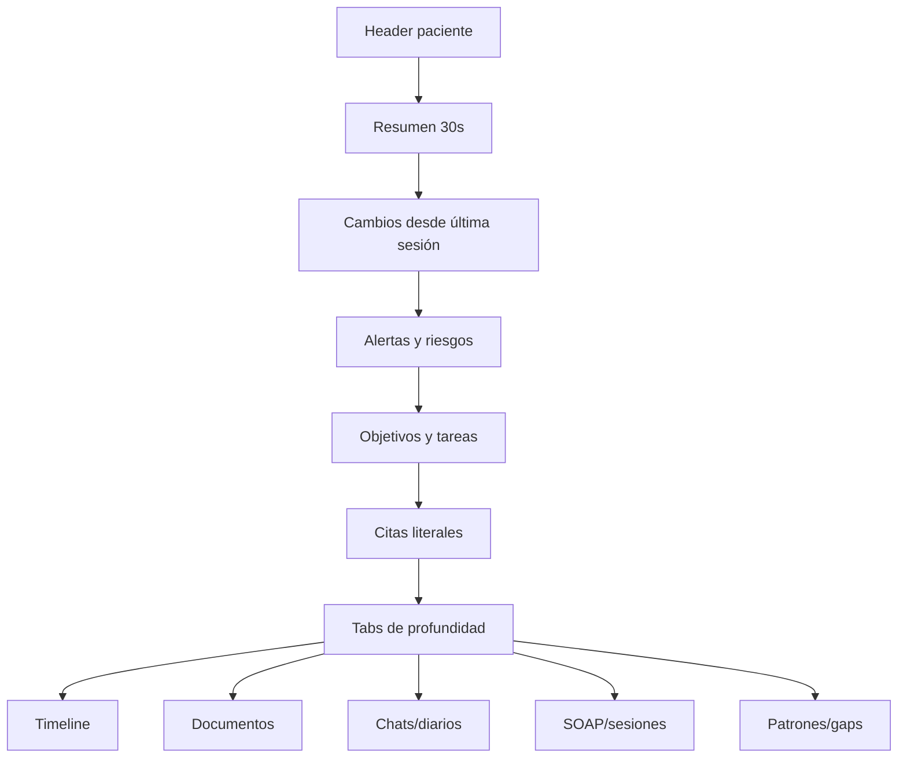

# 15 · Frontend, UX y componentes principales

## 1. Principios UI

- Calma antes que espectáculo.
- Claridad antes que densidad.
- Evidencia antes que interpretación.
- Capas de profundidad, no pantallas saturadas.
- Acciones claras: revisar, validar, rectificar, compartir, reservar.
- Estados vacíos útiles, no pantallas muertas.
- Accesibilidad desde el inicio.

## 2. Sistema visual

### Paleta

- Navy profundo: confianza y estructura.
- Verde salvia: calma y salud.
- Teal: acción secundaria y tecnología tranquila.
- Off-white: fondo cálido.
- Grises azulados: texto y bordes.

### Componentes

- Cards suaves.
- Chips de estado.
- Badges de validación.
- Timeline vertical.
- Panel lateral de evidencia.
- Tabs por profundidad.
- Drawer de detalle.
- Alertas por severidad.
- Empty states explicativos.
- Skeleton loading.

## 3. Navegación web pública

Header:

- Para pacientes
- Para psicólogos
- Psicólogos
- Cómo funciona
- Planes
- Seguridad
- Iniciar sesión
- Empezar

CTA dinámico:

- visitante general → “Empezar”;
- sección pacientes → “Ver psicólogos”;
- sección psicólogos → “Crear perfil profesional”;
- seguridad → “Ver privacidad”.

## 4. Componentes críticos

### 4.1 Evidence Card

Muestra por qué el sistema afirma algo.

Campos:

- tipo de fuente;
- fecha;
- cita literal;
- documento/sesión/chat;
- nivel de autoridad;
- estado de validación;
- botón “ver contexto”.

### 4.2 Proposal Card

Para datos extraídos que deben validarse.

Campos:

- propuesta;
- impacto;
- fuente;
- confianza;
- quién debe validar;
- aceptar;
- editar;
- rechazar;
- preguntar al paciente;
- revisar en sesión.

### 4.3 Patient Quick Brief

Vista de 30 segundos:

- estado actual;
- cambio principal;
- riesgo;
- foco de sesión;
- tarea clave;
- cita importante;
- documento nuevo;
- botón profundidad.

### 4.4 Timeline Event

Campos:

- fecha exacta/aproximada;
- tipo;
- título;
- descripción;
- emoción;
- fuente;
- validación;
- relación con otros eventos.

### 4.5 Risk Banner

Niveles:

- Verde: informativo.
- Ámbar: revisar.
- Rojo: protocolo.

Debe evitar lenguaje alarmista. Debe indicar acción.

## 5. Layout de Patient 360

## 6. App paciente · navegación inferior

- Hoy
- Diario
- Historia
- Sesiones
- Privacidad

Acceso persistente:

- botón crisis;
- perfil/ajustes;
- notificaciones.

## 7. Panel psicólogo · navegación lateral

- Inicio
- Pacientes
- Revisiones
- Agenda
- Alertas
- SOAP
- Documentos
- Pagos
- Perfil público
- Configuración

## 8. Estados vacíos obligatorios

### Paciente sin historial

Mostrar:

- explicación;
- CTA subir documento;
- CTA escribir primera entrada;
- CTA completar triaje.

### Psicólogo sin pacientes

Mostrar:

- crear perfil público;
- invitar pacientes;
- importar CSV;
- revisar guía de Patient 360.

### Patient 360 sin datos suficientes

Mostrar:

- datos disponibles;
- qué falta;
- cómo conseguirlo;
- evitar inventar resumen.

## 9. Accesibilidad

- Contraste AA mínimo.
- Tamaños de texto cómodos.
- Navegación por teclado.
- No depender solo de color.
- Textos alternativos.
- Evitar animaciones agresivas.
- Modo alto contraste en fase posterior.

## 10. Criterios de aceptación UI

Una pantalla está lista cuando:

1. explica qué hacer;
2. muestra estados vacíos;
3. muestra errores sin culpar al usuario;
4. no usa lenguaje clínico peligroso;
5. permite ver fuentes;
6. respeta permisos;
7. es usable en móvil;
8. no bloquea al psicólogo con pasos innecesarios.
