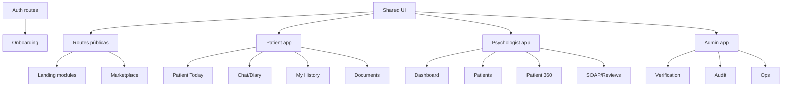

# 16 · Requisitos para revisar y rehacer el repositorio existente

## 1. Objetivo

Este documento sirve para convertir una web/demo existente en una implementación alineada con la intención real de Áncora.

El repositorio debe pasar de “pantallas que enseñan una idea” a “producto conectado por datos, memoria y validación”.

## 2. Auditoría técnica mínima del repositorio

Cuando se tenga acceso al código, revisar:

- framework usado;
- rutas/páginas existentes;
- componentes duplicados;
- estado global;
- auth;
- llamadas API;
- modelos de datos mockeados;
- pantallas sin backend;
- gestión de errores;
- accesibilidad;
- separación paciente/psicólogo/admin;
- seguridad de variables y secretos;
- hardcoded content;
- dependencia de datos falsos;
- formularios sin validación;
- rutas protegidas;
- compatibilidad móvil.

## 3. Señales de demo débil

- datos hardcodeados;
- componentes bonitos pero sin estado real;
- dashboard sin carga/empty/error;
- chat sin persistencia;
- subida de archivos sin pipeline;
- historial vacío;
- cronología no conectada;
- psicólogo sin pacientes reales;
- admin con métricas falsas;
- pagos simulados sin flujo claro;
- IA como texto decorativo.

## 4. Nueva arquitectura frontend recomendada



## 5. Organización sugerida de carpetas

```txt
src/
  app/ or pages/
  modules/
    public/
      home/
      patients/
      psychologists/
      pricing/
      security/
    marketplace/
    onboarding/
    patient/
      today/
      chat/
      history/
      documents/
      sessions/
      privacy/
    psychologist/
      dashboard/
      patients/
      patient360/
      reviews/
      soap/
      agenda/
      billing/
    admin/
      verification/
      audit/
      billing/
      ops/
  components/
    ui/
    evidence/
    clinical/
    layout/
  lib/
    api/
    auth/
    permissions/
    validation/
    analytics/
  types/
    clinical.ts
    patient.ts
    psychologist.ts
    documents.ts
  copy/
    es.ts
  config/
```

## 6. Contratos frontend-backend

El frontend no debe inventar lógica clínica. Debe consumir contratos claros:

- `GET /me`
- `GET /public/psychologists`
- `POST /onboarding/triage`
- `POST /documents/upload-url`
- `GET /documents/:id/processing-status`
- `GET /patients/me/history`
- `POST /chat/sessions`
- `POST /chat/sessions/:id/messages`
- `POST /chat/sessions/:id/close`
- `GET /psychologist/dashboard`
- `GET /psychologist/patients/:id/patient360`
- `PATCH /proposals/:id/validate`
- `POST /soap/:id/validate`

## 7. Typescript types críticos

```ts
export type AuthorityLevel =
  | 'psychologist_validated'
  | 'documented'
  | 'patient_declared'
  | 'ai_inferred';

export type ValidationStatus =
  | 'pending_patient'
  | 'pending_psychologist'
  | 'validated'
  | 'rejected'
  | 'needs_clarification';

export interface EvidenceRef {
  id: string;
  sourceType: 'chat' | 'document' | 'session' | 'soap' | 'psychologist_note';
  sourceId: string;
  quote?: string;
  date?: string;
  authorityLevel: AuthorityLevel;
}

export interface Patient360Snapshot {
  patientId: string;
  generatedAt: string;
  quickSummary: string;
  changesSinceLastSession: string[];
  risks: RiskItem[];
  goals: GoalItem[];
  tasks: TaskItem[];
  keyQuotes: EvidenceRef[];
  documents: DocumentSummary[];
  proposals: UpdateProposal[];
}
```

## 8. Pull requests recomendadas

### PR 1 · Reescritura narrativa pública

- Home nueva.
- Para pacientes.
- Para psicólogos.
- Seguridad.
- FAQ.
- Microcopy de límites.

### PR 2 · Layout y roles

- Separar rutas públicas, paciente, psicólogo y admin.
- Guards por rol.
- Layouts específicos.
- Estados vacíos.

### PR 3 · App paciente real

- Home Hoy.
- Chat con cierre/resumen.
- Documentos con estado de procesamiento.
- Mi Historia.

### PR 4 · Panel psicólogo real

- Dashboard.
- Lista pacientes.
- Patient 360.
- Revisión y SOAP.

### PR 5 · Backend contracts mock-first

- Crear API mock tipada.
- Sustituir hardcodeos por contratos.
- Preparar integración real.

### PR 6 · Seguridad y compliance UI

- Consentimientos.
- Privacidad.
- Exportación.
- Crisis.
- Auditoría visible para usuario.

## 9. Definition of Done del repositorio

El repo está alineado cuando:

1. La landing explica la intención de Áncora.
2. Cada rol tiene rutas y permisos claros.
3. El paciente puede entender qué datos se guardan y corregirlos.
4. El psicólogo puede ver Patient 360 aunque sea con mocks realistas.
5. No hay claims de IA terapeuta.
6. Todo análisis mostrado tiene evidencia.
7. Hay estados loading/error/empty.
8. La estructura permite conectar backend real sin rehacer todo.
