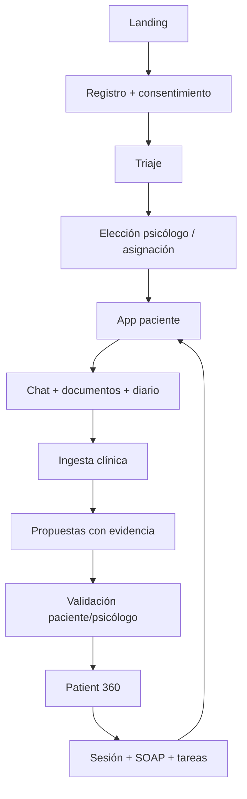

# 18 · Plan de reconstrucción del repo hacia producto real

## 1. Objetivo

Convertir el repositorio actual en una web/app clínica coherente, segura y mantenible sin perder las ideas ya desarrolladas.

El objetivo no es “arreglar pantallas”. El objetivo es que cada pantalla pertenezca a un flujo de producto:



## 2. Estrategia: no parchear, refactorizar por dominios

### Dominios finales

```text
src/
  app/                  # providers, router, shells
  config/               # env, feature flags
  shared/               # UI, hooks, utils
  domain/
    auth/
    users/
    clinical/
    documents/
    memory/
    risk/
    appointments/
    billing/
    marketplace/
  features/
    public-web/
    onboarding/
    patient-app/
    psychologist-panel/
    admin-console/
  integrations/
    firebase/
    model-gateway/
```

## 3. Fase 0 — Seguridad y limpieza antes de tocar producto

### Tareas

- Mover Firebase URL y anon key a `.env`.
- Rotar credenciales si el proyecto real ha quedado expuesto.
- Eliminar documentos personales/sensibles del repo.
- Quitar `.temp`, logs, reportes personales y scripts experimentales del repositorio público.
- Añadir `.env.local`, `.env.production`, `.env.staging` fuera de git.
- Restringir CORS en Edge Functions.
- Crear `SECURITY.md` real.

### Resultado esperado

Un repo que no expone datos personales, no mezcla proyectos y no contradice la privacidad prometida.

## 4. Fase 1 — Producto core limpio

### Conservar

- `LandingView` como base visual, pero dividir.
- `LoginView` como base de auth, pero separar onboarding.
- Módulos paciente reales: Hoy, Chat, Diario, Timeline, Sesiones, Historia, Privacidad, Perfil, Plan.
- Módulos psicólogo: Dashboard, Pacientes, Patient 360, SOAP, Preparación, Agenda.
- `clinicalEngine.js` como primera capa de API clínica.
- Edge Functions clínicas.

### Eliminar o archivar

- `TradingView.jsx`.
- `components/trading/*`.
- módulos BingX;
- INSS/deudas;
- datos personales de Emilio/Walter;
- scripts de test conectados a proyecto real;
- documentación duplicada dentro del repo de app.

### Reorganizar

`PsicologoDashboardView.jsx` debe dividirse en:

```text
features/psychologist-panel/
  PsychologistShell.tsx
  PsychologistHome.tsx
  PatientList.tsx
  Patient360/
    Patient360Page.tsx
    PatientHeader.tsx
    QuickBrief.tsx
    EvidenceFeed.tsx
    ProposalInbox.tsx
    ClinicalTimeline.tsx
    MedicationPanel.tsx
    RiskPanel.tsx
    SoapPanel.tsx
    TasksPanel.tsx
    ConsentPanel.tsx
  Agenda/
  Billing/
```

`PacienteChatView.jsx` debe dividirse en:

```text
features/patient-app/chat/
  PatientChatPage.tsx
  ConversationList.tsx
  ChatComposer.tsx
  VoiceNoteUploader.tsx
  FileDropzone.tsx
  CrisisBanner.tsx
  MemoryNotice.tsx
  CreditsIndicator.tsx
```

## 5. Fase 2 — Modelo de datos único

### Problema actual

Hay tablas antiguas, tablas personales, tablas clínicas y fallbacks de localStorage. Esto genera resultados inconsistentes.

### Target mínimo

```text
profiles
patients
psychologists
psychologist_patient_links
consents
appointments
chat_sessions
chat_messages
clinical_documents
document_extractions
clinical_evidence
clinical_facts
clinical_proposals
timeline_events
medications
risk_events
therapy_goals
tasks
soap_notes
weekly_reviews
patient_context_snapshots
audit_logs
```

### Decisión importante

Crear tabla `clinical_evidence` independiente:

```sql
clinical_evidence (
  id uuid,
  patient_id uuid,
  source_type text,
  source_id uuid,
  quote text,
  locator jsonb,
  extracted_at timestamptz,
  created_at timestamptz
)
```

Luego `clinical_facts`, `timeline_events`, `medications`, `risk_events`, `soap_notes` referencian evidencias.

## 6. Fase 3 — Pipeline real de datos clínicos

### Pipeline documento

1. Upload seguro.
2. Malware/validación tipo/tamaño.
3. Registro `clinical_documents`.
4. Extracción texto.
5. Segmentación/chunking.
6. Clasificación documental.
7. Extracción JSON.
8. Creación de evidencias.
9. Creación de propuestas.
10. Revisión paciente/psicólogo.
11. Consolidación por autoridad.
12. Reindexación RAG.
13. Snapshot Patient 360.

### Pipeline chat

1. Mensaje del paciente.
2. Safety pre-check.
3. Context harness.
4. Respuesta IA limitada.
5. Guardado cifrado.
6. Extracción ligera por turno.
7. Extracción post-sesión.
8. Daily summary.
9. Propuestas si hay datos nuevos.
10. Riesgo si aplica.
11. Snapshot nocturno.

## 7. Fase 4 — Patient 360 como pantalla central

El Patient 360 debe usar contratos, no mocks.

### Endpoint recomendado

```http
GET /patients/:id/patient-360
```

Respuesta:

```json
{
  "quick_brief": {},
  "changes_since_last_session": [],
  "risk": {},
  "goals": [],
  "tasks": [],
  "evidence_feed": [],
  "timeline": [],
  "medications": [],
  "documents": [],
  "pending_proposals": [],
  "soap": [],
  "consents": {},
  "audit_summary": {}
}
```

## 8. Fase 5 — Model Gateway

Crear interfaz única:

```ts
interface ModelGateway {
  complete(request: CompletionRequest): Promise<CompletionResult>
  extractJson<T>(request: JsonExtractionRequest<T>): Promise<T>
  embed(texts: string[]): Promise<number[][]>
  transcribe(audio: BlobRef): Promise<Transcript>
}
```

Providers:

- `OpenRouterProvider` solo dev/staging con consentimiento.
- `LocalVllmProvider` target.
- `PrivateEUProvider` opcional.

## 9. Fase 6 — Tests clínicos sintéticos

Crear carpeta:

```text
tests/clinical-fixtures/
  patient_001/
    chat_01.txt
    informe_psicologico.pdf.txt
    medicacion.txt
    expected_proposals.json
    expected_snapshot.json
```

Métricas de test:

- no inventa diagnóstico;
- no usa fecha falsa;
- preserva citas;
- crea propuestas correctas;
- no consolida IA como validado;
- detecta riesgo;
- ignora contenido fuera de alcance;
- actualiza Patient 360.

## 10. Definition of Done del repo reconstruido

Una funcionalidad clínica no está terminada hasta que:

- tiene tabla o contrato de datos;
- tiene control de permisos;
- tiene consentimiento asociado si aplica;
- genera auditoría;
- no escribe datos definitivos sin validación;
- muestra evidencia;
- tiene estado vacío;
- tiene error state;
- tiene test con fixture sintético;
- no depende de localStorage para información clínica real;
- no usa mocks fuera de modo demo.
