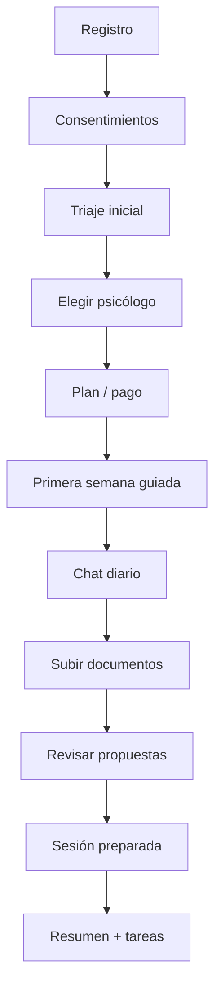
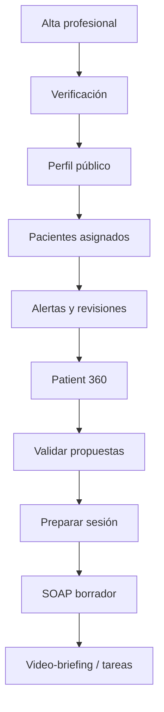

# 19 · Modelo funcional final de la web/app de Áncora

## 1. Intención final

La web no debe ser una presentación bonita ni una colección de dashboards. Debe ser la demostración inmediata de una idea:

> Áncora convierte la información dispersa del paciente en memoria terapéutica útil, revisable y supervisada.

## 2. Promesa para paciente

### Mensaje principal

**No tienes que cargar tú solo con toda tu historia. Áncora te ayuda a ordenarla para que tu psicólogo pueda entenderte mejor y más rápido.**

### Lo que debe sentir

- “Puedo hablar o subir documentos sin perderme.”
- “La app recuerda lo importante, pero yo puedo corregirlo.”
- “Mi psicólogo no llega a ciegas.”
- “La IA no me diagnostica; me ayuda a preparar la terapia.”
- “Mis datos están protegidos.”

## 3. Promesa para psicólogo

### Mensaje principal

**Antes de cada sesión, Áncora te muestra lo importante del paciente en dos minutos, con evidencia, citas y cambios desde la última revisión.**

### Lo que debe sentir

- “No tengo que leer 200 mensajes.”
- “Veo datos crudos y análisis con evidencia.”
- “Puedo validar, corregir o rechazar propuestas.”
- “Tengo SOAP borrador, tareas y objetivos organizados.”
- “Ahorro tiempo sin perder criterio clínico.”

## 4. Web pública final

### Header

- Logo.
- Pacientes.
- Psicólogos.
- Cómo funciona.
- Psicólogos disponibles.
- Planes.
- Seguridad.
- Entrar.
- Empezar.

### Hero

Título recomendado:

> Terapia con memoria entre sesiones.

Subtítulo:

> Chat diario guiado, documentos ordenados y contexto claro para tu psicólogo. La IA estructura y acompaña; el criterio clínico siempre es humano.

CTA:

- Empezar como paciente.
- Soy psicólogo.

### Bloque problema

- La terapia pierde contexto entre sesiones.
- El paciente olvida detalles o se agota repitiendo.
- El psicólogo recibe información dispersa.
- La IA autónoma no es segura como terapeuta.

### Bloque solución

Áncora organiza:

- chats;
- diarios;
- documentos;
- citas literales;
- sesiones;
- tareas;
- objetivos;
- riesgos;
- evolución.

### Bloque “No somos un psicólogo IA”

Texto:

> Áncora no diagnostica, no prescribe y no sustituye a un profesional. Es una plataforma de continuidad terapéutica supervisada que convierte información desordenada en contexto útil.

## 5. Recorrido paciente

## 6. Recorrido psicólogo

## 7. App paciente final

### Pantallas

1. **Hoy**: estado, próxima sesión, tarea principal, check-in, acceso a chat.
2. **Chat diario**: conversación guiada, límites visibles, subida rápida de archivos.
3. **Diario emocional**: emociones, intensidad, sueño, eventos, notas.
4. **Mi historia**: timeline, antecedentes, documentos, medicación declarada.
5. **Propuestas pendientes**: “Áncora ha encontrado esto. ¿Es correcto?”
6. **Sesiones**: calendario, reserva, preparación, resumen posterior.
7. **Plan terapéutico**: objetivos, tareas, recursos validados.
8. **Privacidad**: consentimientos, exportar, borrar, qué comparte con psicólogo.

## 8. Panel psicólogo final

### Home

- pacientes con revisión pendiente;
- riesgos activos;
- cambios relevantes;
- agenda de hoy;
- propuestas pendientes;
- ingresos/facturación si aplica.

### Patient 360

Capas:

1. **30 segundos:** estado, riesgo, último cambio, próxima acción.
2. **2 minutos:** cambios desde última sesión, citas, tareas, objetivos, documentos nuevos.
3. **Profundidad:** timeline, documentos, sesiones, SOAP, historial médico/psicológico, patrones, gaps.

## 9. Admin final

- validación de psicólogos;
- incidencias técnicas;
- pagos y planes;
- auditoría;
- solicitudes RGPD;
- gestión de plantillas legales;
- métricas operativas sin contenido clínico.

## 10. Copys que deben sustituir ideas peligrosas

No usar:

- “IA terapeuta”.
- “Diagnóstico automático”.
- “Cura ansiedad/depresión”.
- “Chat psicológico ilimitado”.

Usar:

- “acompañamiento guiado”.
- “memoria terapéutica”.
- “contexto organizado”.
- “borradores revisables”.
- “criterio clínico humano”.
- “evidencia y citas”.
