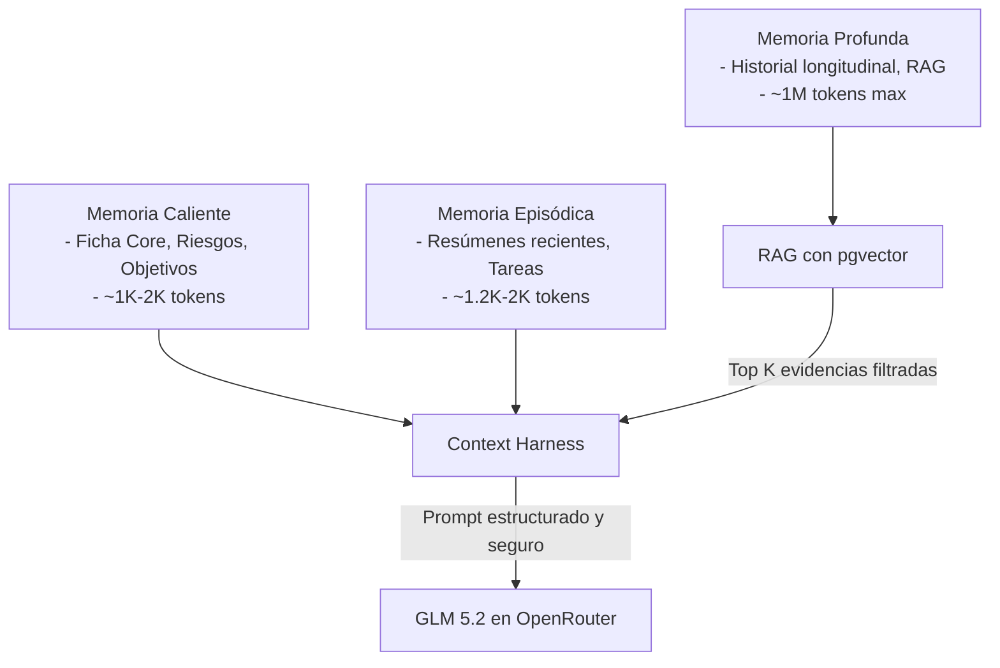
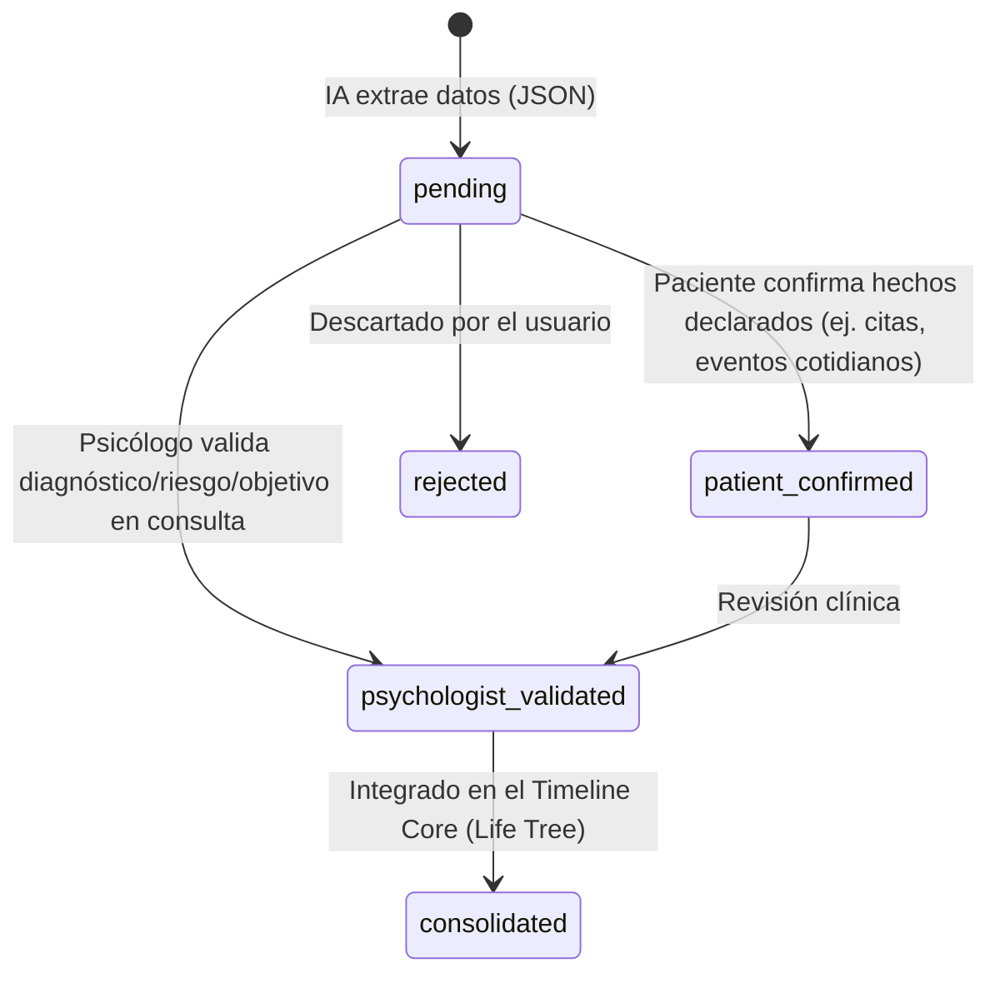

# Síntesis Arquitectónica: Sistema de Continuidad Terapéutica, Context Harness y Loops de Memoria Asíncronos Basado en GLM 5.2 (Zhipu AI)

Este documento especifica la arquitectura técnica, las mejores prácticas de prompting y la gestión de memoria para la plataforma de continuidad terapéutica **Áncora**, utilizando el modelo **GLM 5.2** (Zhipu AI) a través de **OpenRouter** (identificado como `z-ai/glm-5.2` o el endpoint activo correspondiente).

El sistema está diseñado bajo una premisa fundamental: **la IA procesa y propone; el humano (paciente y psicólogo) valida**. Ninguna inferencia o hecho clínico extraído por el LLM se asume como verdad médica sin supervisión explícita.

---

## 1. Context Harness y Gestión de la Ventana de Contexto (Context Window)

La gestión del contexto clínico longitudinal para historiales médicos y conversaciones diarias requiere un enfoque estructurado para evitar la fragmentación, controlar el costo de tokens y garantizar que el modelo siempre respete las políticas de seguridad clínica y de privacidad.

### 1.1 El Enfoque de Tres Niveles de Memoria
El contexto del paciente se divide en tres niveles organizativos:



1. **Memoria Caliente (Hot Memory):** Información clínica core que debe enviarse en cada interacción (IDs, consentimientos activos, estado clínico general, **riesgos activos**, objetivos terapéuticos actuales, medicación declarada, restricciones de seguridad y directrices de comunicación).
2. **Memoria Episódica (Episodic Memory):** Historial conversacional y de eventos de las últimas 1-2 semanas (transcripción de la última sesión, check-ins diarios, resúmenes de chats recientes y tareas del paciente).
3. **Memoria Profunda (Deep Memory):** Archivo histórico completo (timeline vital, diagnósticos documentados, informes clínicos históricos, notas SOAP validadas). Se accede a ella a través de **RAG aislado por paciente** (utilizando `pgvector` con indexación HNSW) y búsqueda híbrida (semántica + lexical clínica).

### 1.2 El Rendimiento de GLM 5.2 en Contexto Amplio y Razonamiento
El modelo chino **GLM 5.2** destaca por:
* **Razonamiento Complejo de Alto Nivel:** Ofrece una capacidad competitiva con GPT-4o y Claude 3.5 Sonnet para tareas de estructuración lógica, deducción de patrones y resolución de contradicciones clínicas.
* **Ventana de Contexto Extendida:** Permite procesar grandes transcripciones y resúmenes históricos acumulados en una sola pasada.
* **Excelente Soporte Multilingüe:** Su comprensión del español clínico coloquial y desestructurado (como las expresiones y dialecto de Emilio) es sumamente precisa.

### 1.3 Presupuesto de Tokens y Algoritmo de Ensamblado (Context Harness)
El backend inteligente de Áncora calcula dinámicamente un presupuesto de tokens para cada llamada conversacional o de procesamiento.

| Componente del Contexto | Presupuesto en Chat Diario | Presupuesto en Briefing/SOAP |
|---|---|---|
| System Instructions Clínicas | 600 tokens | 1,000 tokens |
| Memoria Caliente (Ficha, Riesgos) | 500 tokens | 800 tokens |
| Memoria Episódica (Último chat) | 1,200 tokens | 2,500 tokens |
| RAG / Evidencias Deep Memory | 1,500 tokens | 8,000+ tokens |
| Tarea específica + Instrucciones JSON | 300 tokens | 500 tokens |
| **Total Recomendado** | **4,100 tokens** | **13,000+ tokens** |

---

## 2. Loops de Memoria y Consolidación Asíncrona de Hechos

Para evitar que la conversación diaria del paciente contamine la ficha clínica definitiva con inferencias inexactas del modelo de IA, se implementa una arquitectura basada en **Workers asíncronos y colas de prioridad (Redis + BullMQ)**.

### 2.1 El Ciclo de Consolidación de Memoria
El sistema no actualiza la memoria persistente en caliente. En su lugar, opera mediante tres loops temporales:

```text
Mensaje de Chat del Paciente
  ↓
  ├─ síncrono ──> Clasificación y Detección de Riesgo Crítico (GLM 5.2 / Reglas Regex)
  ↓
  └─ asíncrono (Al cerrar sesión de chat diaria)
        ↓
        1. Extractor Clínico: GLM 5.2 extrae "Propuestas de Ficha" (JSON)
        2. Detección de Contradicciones contra la memoria existente
        3. Identificación de Gaps Clínicos (información ausente)
        4. Guardar en BD como "Propuestas Pendientes" (update_proposals)
        5. Generación de microresumen diario y actualización de embeddings en pgvector
```

* **Loop Diario (Post-Chat):** Extracción de hechos declarados, emociones dominantes y citas textuales relevantes. Generación del resumen diario y actualización de la memoria episódica.
* **Loop Semanal (Batch):** Consolidación de tendencias, evolución de objetivos terapéuticos y preparación del borrador de briefing para el psicólogo.
* **Loop Post-Sesión (Humano-IA):** Transcripción del audio de la sesión (con consentimiento), extracción de acuerdos/tareas y generación de borrador de nota SOAP para el profesional.

### 2.2 Jerarquía y Matriz de Autoridad de los Datos
Para garantizar la precisión médica, cada hecho almacenado en la base de datos de Áncora lleva asociado un **Nivel de Autoridad**:

| Nivel de Autoridad | Descripción | Capacidad de Actualización Directa |
|---|---|---|
| **1. Psicólogo Validado** | Datos ingresados o validados por el profesional humano. | Escribe directamente en la ficha clínica core. |
| **2. Documentado** | Datos extraídos de informes, recetas y analíticas médicas oficiales. | Genera propuestas de alta confianza. |
| **3. Paciente Declarado** | Hechos explícitos informados directamente por el paciente en el chat. | Requiere confirmación (paciente) y/o revisión (psicólogo). |
| **4. IA Inferido** | Patrones, emociones implícitas o hipótesis de la IA. | **Prohibido escribir en ficha.** Solo sirve de briefing o sugerencia visual. |

---

## 3. Human-in-the-Loop (HITL) en Psicología Asistida por IA

La seguridad clínica y la ética en salud mental exigen que la IA actúe como un copiloto estructurado y nunca como un agente clínico autónomo.

### 3.1 Dual-Interface de Validación (Pacientes y Psicólogos)
Las propuestas de actualización de memoria (`update_proposals`) pasan por un flujo de estados estricto antes de consolidarse en la historia clínica del paciente:



* **Validación del Paciente:** Confirma hechos personales sencillos ("¿Es correcto que empezaste tu nuevo trabajo el 15 de junio?"), medicación declarada y eventos de su cronología diaria.
* **Validación del Psicólogo:** Obligatoria para cualquier hipótesis clínica, definición de objetivos terapéuticos, notas SOAP, asignación de tareas terapéuticas y flags de riesgo moderado/alto.

### 3.2 UI Basada en Evidencia (Evidence Cards)
Cualquier resumen, propuesta o análisis presentado al psicólogo en el panel **Paciente 360** debe estar anclado a evidencias inmutables. 
No se muestran resúmenes abstractos sin su correspondiente *Evidence Card*, la cual incluye:
* La cita textual exacta (*verbatim*).
* El localizador de la fuente (archivo PDF original, número de página, ID del mensaje de chat o marca de tiempo de la sesión de audio).
* El nivel de confianza de la extracción y el nivel de autoridad correspondiente.

---

## 4. Extracción de Entidades Clínicas con GLM 5.2 en OpenRouter

La extracción estructurada de entidades críticas (medicación, síntomas, eventos vitales, riesgos) es el motor que alimenta el **Árbol de Vida** (cronología longitudinal del paciente). GLM 5.2 es idóneo debido a su soporte para JSON Schema estricto.

### 4.1 Configuración de GLM 5.2 en OpenRouter
Para garantizar la precisión de la extracción y evitar alucinaciones, la API de OpenRouter debe configurarse con los siguientes parámetros:
* **Modelo:** `z-ai/glm-5.2` (o el identificador activo para GLM 5.2 en OpenRouter).
* **Temperatura:** `0.0` (garantiza determinismo en la extracción).
* **Response Format:** `"json_object"` o `"json_schema"`. Esto obliga a GLM 5.2 a estructurar la respuesta respetando rigurosamente el esquema JSON definido.

### 4.2 Ejemplo de Prompt de Extracción con Ancla Temporal
El prompt inyecta dinámicamente un punto de anclaje de fechas para evitar que el modelo alucine años ficticios sobre tramos de edad:

```typescript
const systemPrompt = `Actuas como asistente de historia clinica de Ancora. Tu trabajo es convertir el texto de la fuente en datos clinicos estructurados, con criterio medico, para que un psicologo entienda al paciente de un vistazo y pueda intervenir. NO eres psicologo, NO diagnosticas, NO prescribes.

ANCLA TEMPORAL ABSOLUTA:
- El paciente Emilio nació el año 1978.
- La fecha de hoy es \${currentDate}.
- Usa estos datos para calcular los años de cada evento. Si el texto indica "a los 23 años", calcula la fecha como 1978 + 23 = 2001. Si el texto indica "hace 4 años", resta 4 a la fecha actual (2026 - 4 = 2022).

REGLAS CLINICAS ABSOLUTAS:
1. Extrae SOLO lo que esta presente o claramente inferible en el texto. Nunca inventes.
2. Toda afirmacion clinica debe llevar verbatim_quote (cita literal exacta del texto que la sostiene). Sin cita, no la incluyas.
3. Separa Hechos (life_line, medications) de Hipotesis (redactadas como posibilidad: "posible patron de...", "podria relacionarse con...").
4. FILTRADO INTELIGENTE DE TRADING: Distingue entre trading técnico y trading sintomático. Ignora el análisis de gráficos, setups o stop loss puros. Pero si el paciente describe la incapacidad física de cerrar una posición ganadora, pánico al stop loss, perder los ahorros de su madre o haber fundido su nómina de 3.300 € el día 4, es un síntoma clínico crítico de desregulación y de conducta autodestructiva, por lo que debes extraerlo obligatoriamente.`;
```
