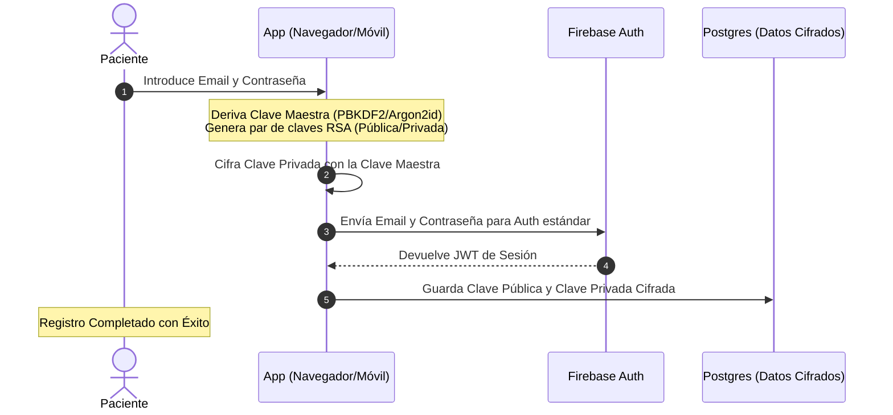
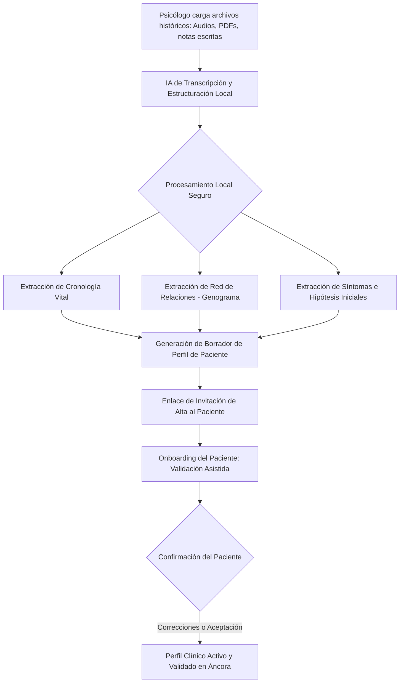

# AUDITORÍA INTEGRAL DE VIABILIDAD, EVOLUCIÓN TÉCNICA Y ESTRATEGIA COMERCIAL - ÁNCORA APP

Este documento unificado y consolidado reúne toda la información técnica, económica, legal, regulatoria, de ciberseguridad, modelo de negocio Dual-SaaS, arquitectura de interfaz UX/UI clínica e identidad de marca (Naming) de la plataforma **Áncora** (Terapia online y diario estructurado en servidor local privado). 

Representa la evolución definitiva de la plataforma: de un marketplace transaccional convencional a una **infraestructura clínica permanente y portable** que conecta de forma perpetua a pacientes y psicólogos, asegurando la privacidad absoluta mediante procesamiento local y criptografía Zero-Knowledge.

---

# 1. RESUMEN EJECUTIVO (DASHBOARD GENERAL DE VIABILIDAD)

Análisis consolidado elaborado por agentes virtuales especializados en auditar la viabilidad técnica, regulatoria, clínica y deontológica de una plataforma híbrida de seguimiento de telepsicología basada en modelos locales de IA y servidores físicos controlados por la plataforma.

### KPIs de Viabilidad y Estado de la Infraestructura
*   **Viabilidad Regulatoria:** Alta (bajo el modelo de exención del IVA y separación de roles SaaS).
*   **Margen Bruto Unitario (Plataforma):** ~73.0% en suscripción de software.
*   **Ingreso Recurrente Neto Mensual (MRR por Paciente Activo):** **40,02 €** (prorrateando SaaS de psicólogo, SaaS de diario de paciente y comisiones transaccionales de Stripe).
*   **Ratio LTV / CAC Consolidado:** **3.79x** (LTV neto de **360,18 €** frente a CAC consolidado de **95,00 €**).
*   **Periodo de Payback del CAC:** **2.4 meses** (Payback medio de 72 días).
*   **TCO Servidor Anual:** ~2,545€ (Dual RTX 4090) o amortización en ~10 meses frente a Cloud APIs.
*   **Capacidad de Servidor Local:** **1.000 usuarios activos mensuales (MAU) por PC potente**.

### Dictamen de Viabilidad Comercial y Operativa
Tras el debate de los agentes de auditoría, se emite un **dictamen de viabilidad condicionado a un modelo de negocio Dual-SaaS y procesamiento Local-First**. El modelo original de "Uberización abierta" con fijación unilateral de tarifas e intermediación porcentual es inviable en España debido a la Sentencia 805/2020 del Tribunal Supremo (riesgo de "falsos autónomos") y el veto del Real Decreto 1907/1996 a testimonios de curación pública.

Para sortear estas restricciones, la plataforma adopta una **Fase de Onboarding y Triaje Inicial de 49,00 €** (split en origen: 25€ netos al psicólogo por 1h de consulta inicial y 24€ de software a la plataforma) y una estructura de **suscripciones de software separadas**: el paciente paga **29,00 €/mes** por su diario e historial portátil cifrado (SaaS B2C) y el psicólogo paga **49,00 €/mes tarifa plana** por su gestor clínico profesional (SaaS B2B). Los flujos monetarios se dividen en origen mediante **Stripe Connect Express (Direct Charges)**: el psicólogo factura directamente al paciente la parte clínica exenta de IVA (Art. 20.Uno.3º Ley IVA) y la plataforma factura el servicio informático con el 21% de IVA, eliminando la laboralidad y blindando la exención fiscal del profesional.

---

# 2. PILARES DE RETENCIÓN Y VALOR DE LA HISTORIA CLÍNICA PORTABLE

El núcleo y moat competitivo de Áncora reside en el cambio de activo principal. La app no vende minutos de videollamadas (un producto altamente commoditizado y precarizado); vende la **preservación, soberanía y estructuración del historial mental del paciente** de por vida.

### Los 4 Pilares de la Retención Clínica
1.  **Portabilidad Estructurada (Coste de Cambio Extremo):** La historia clínica del paciente no está secuestrada en el archivador de una clínica ni se disuelve si cambia de terapeuta. Pertenece al paciente en un formato JSON/PDF estructurado y cifrado. Salirse de Áncora implica perder su diario evolutivo, su RAG contextual y forzar al paciente a "empezar de cero" y volver a contar su historia a un terapeuta nuevo.
2.  **Eficiencia Clínica (Smart SOAP):** Los psicólogos pierden entre el 20% y el 30% de su tiempo redactando notas SOAP y resúmenes. Con el copiloto de Áncora, la sesión genera un borrador clínico en 2 minutos tras terminar la llamada. Volver a trabajar de forma tradicional (papel o Word) representa una pérdida inaceptable de 8 a 10 horas semanales de trabajo administrativo.
3.  **Seguimiento Diario Activo (Rompiendo la Amnesia Terapéutica):** El paciente registra sus emociones y crisis a lo largo de la semana. La IA organiza y sintetiza estos datos. El psicólogo no empieza la sesión preguntando "¿cómo te ha ido la semana?", sino yendo al grano sobre la crisis del martes a las 11:00.
4.  **Privacidad Física en Servidores Dedicados:** Todo el procesamiento e inferencia ocurre de manera local. Los datos de salud (categoría especial bajo el RGPD) jamás viajan a APIs comerciales de Estados Unidos (OpenAI, Anthropic) ni se usan para entrenar modelos externos. Esto blinda al terapeuta deontológicamente y ofrece tranquilidad absoluta al paciente.

---

# 3. PROPUESTA DE VALOR Y SEGURIDAD ZERO-KNOWLEDGE

El modelo propone una arquitectura híbrida **"Human-in-the-Loop" (Copiloto Clínico)**. La Inteligencia Artificial actúa exclusivamente como un optimizador de procesos de seguimiento, diarios emocionales y generación de briefings, mientras que el diagnóstico, la validación y el criterio clínico final corresponden a psicólogos colegiados y habilitados sanitariamente.

### A. Soberanía de Datos y Privacidad Local-First
La diferenciación competitiva frente a marketplaces genéricos se construye sobre la **privacidad física absoluta**:
*   **Procesamiento Local-First:** El análisis de los patrones emocionales, diarios y grabaciones de voz se procesa localmente en servidores dedicados de la plataforma en España. Ningún dato clínico viaja a nubes comerciales ni a servicios de terceros.
*   **Servidores Áncora de "Cero Conocimiento":** La sincronización utiliza criptografía asimétrica del lado del cliente. Los administradores de la base de datos de Áncora no pueden leer el contenido clínico.

### B. Arquitectura Criptográfica del Registro de Pacientes
Para garantizar la confidencialidad requerida por la Ley de Autonomía del Paciente y el RGPD para datos de salud (Categoría Especial - Art. 9), implementamos un sistema criptográfico del lado del cliente donde los administradores de la base de datos no pueden descifrar el contenido.



1.  **Autenticación Estándar:** El usuario se registra a través de Firebase Auth (correo/contraseña).
2.  **Generación de Claves Criptográficas Locales:**
    *   Al registrarse, el cliente (JavaScript en el navegador mediante la **WebCrypto API**) ejecuta una función de derivación de claves **Argon2id** o **PBKDF2 (600,000 iteraciones + sal única)** utilizando la contraseña del usuario. Esto genera una **Clave Maestra de Cifrado (KEK)** que nunca sale de su dispositivo.
    *   El cliente genera un par de claves asimétricas RSA-OAEP de 3072 bits (Clave Pública y Clave Privada).
    *   La **Clave Privada** se cifra localmente mediante AES-GCM-256 utilizando la **Clave Maestra (KEK)**.
    *   La **Clave Pública** y la **Clave Privada Cifrada** se envían y almacenan en la base de datos de Firebase.
3.  **Flujo de Cifrado del Diario / Chats:**
    *   Cada entrada de diario o mensaje del chat se cifra en el cliente con una clave simétrica AES-GCM-256 generada al vuelo (*Clave de Sesión*).
    *   Esta *Clave de Sesión* se cifra por duplicado: una vez con la Clave Pública del Paciente, y otra vez con la Clave Pública del Psicólogo asignado.
    *   Se almacena en la base de datos el contenido del mensaje cifrado y las dos copias cifradas de la clave de sesión.
    *   **Resultado:** Solo el paciente (descifrando con su clave privada tras meter su contraseña) y su psicólogo asignado pueden leer el contenido. El servidor central de la plataforma solo ve bytes aleatorios.

---

# 4. INTERFAZ DE USUARIO Y ARQUITECTURA UX CLÍNICA (MENTE SANA UI)

El diseño visual y de interacción se rige por un esquema empático, libre de disparadores de ansiedad y con accesibilidad universal (cumplimiento WCAG 2.1 AAA). Se implementa el sistema de diseño visual **"Mente Sana UI"**, utilizando la tipografía *Outfit* para encabezados y *Inter* para datos clínicos.

### Paleta de Colores de Calma Clínica
*   **Sage Forest (#1F3A31):** Color primario. Transmite solidez profesional, arraigo y tranquilidad.
*   **Muted Teal (#4A7B72):** Color secundario para botones de acción clínica y etiquetas de estado.
*   **Alabaster Cream (#FAFAF7):** Fondo de la aplicación. Un tono crudo suave que reduce la fatiga visual.
*   **Dissonance Coral (#E07A5F):** Color funcional de alerta de discrepancia o alertas cognitivas.
*   **Glassmatic White (#FFFFFF30) / Border (#FFFFFF60):** Capa traslúcida con desenfoque de fondo (`backdrop-filter: blur(12px)`) para el bloqueo interpretativo "Raw-First".

---

### A. Estructura Detallada del Panel del Psicólogo

Diseñado bajo la regla UX de **"Cero Clics Inútiles"**, este panel organiza la información clínica con una jerarquía que prioriza la escucha activa durante la consulta.

```
+-----------------------------------------------------------------------------+
| ÁNCORA CLINIC  [Dr. Javier Ruiz]                    Sábado, 30 Mayo 2026   |
+-----------------------------------------------------------------------------+
|  [Pacientes]   |  PACIENTE ACTUAL: Sofía Mendoza (Edad: 29)                 |
|  [Calendario]  |  Objetivo Terapéutico: Regulación Ansiedad Generalizada    |
|  [Historial]   +-----------------------------+------------------------------+
|  [Ajustes]     | COLUMNA A: RAW DATA (Real)  | COLUMNA B: IA CO-PILOT       |
|                |                             | [BLOQUEO GLASSMORPHIC ACTIVE]|
|                | > Diario Semanal Reciente:  | +--------------------------+ |
|                |   - "Siento que el pecho    | |  REVELAR CAPA DE ANÁLISIS| |
|                |      me oprime en el lab."  | |       CLÍNICO DE IA      | |
|                |   - Escala Animo: 3/10      | |                          | |
|                |                             | |  [ Habilitar Insights ]  | |
|                | > Constantes y Expresión:   | +--------------------------+ |
|                |   - Tono voz: Tenso/Rápido  |                              |
|                |                             | > Teleprompter de Revisión   |
|                | > Notas de la Sesión (Manual|   - Redactar informe de      |
|                |   o Dictado Libre)          |     revisión y enviar vídeo  |
|                +-----------------------------+------------------------------+
| [Dictar SOAP]  | [Iniciar Grabación Audio] -> Generación de Notas SOAP Auto  |
+----------------+------------------------------------------------------------+
```

1.  **El Enfoque "Raw-First" con Capa Glassmorphic (Mitigación del Sesgo de Confirmación):**
    *   La interpretación diagnóstica de la IA se presenta inicialmente difuminada y oculta bajo un filtro CSS esmerilado (`backdrop-filter: blur(12px)`).
    *   El psicólogo se ve obligado a revisar primero los datos objetivos crudos (*Raw Data*): extractos literales de conversaciones, check-ins emocionales e indicadores biográficos objetivos, antes de hacer clic en *"Revelar Análisis de IA"*. Esto mitiga el sesgo de automatización diagnóstica.
    ```css
    .glass-interpretative-lock {
      position: absolute;
      top: 0; left: 0; width: 100%; height: 100%;
      background: rgba(250, 250, 247, 0.45);
      backdrop-filter: blur(12px) saturate(120%);
      border: 1px solid rgba(255, 255, 255, 0.6);
      border-radius: 12px;
      display: flex; flex-direction: column; align-items: center; justify-content: center;
      transition: all 0.4s cubic-bezier(0.16, 1, 0.3, 1);
      z-index: 10;
    }
    .glass-interpretative-lock.unlocked {
      opacity: 0;
      pointer-events: none;
      transform: scale(0.98);
    }
    ```
2.  **Indicadores de Discrepancia y Disonancia Cognitiva:**
    *   La IA monitoriza incongruencias entre lo que el paciente reporta en frío (diarios escritos) y su comportamiento en caliente (expresión verbal en sesión).
    *   Si el paciente califica su estado de ánimo con un 9/10 en el diario, pero su prosodia en el análisis de audio de la sesión indica ansiedad severa (velocidad de habla acelerada, tono de voz agudo y tenso), el sistema enciende una alerta `Dissonance Coral (#E07A5F)` sugiriendo indagar en la deseabilidad social o evitación emocional.
3.  **Teleprompter de Revisión y Envío de Vídeo:**
    *   Una ventana asistida por IA local que ayuda al psicólogo a redactar ágilmente el informe de revisión clínica post-sesión basándose en las notas rápidas y transcripciones, facilitando además la grabación y el envío directo del vídeo-resumen o feedback clínico personalizado al paciente al finalizar su análisis.
4.  **Copiloto de Notas SOAP por Audio:**
    *   Al terminar la sesión, el terapeuta activa el dictado clínico de resumen (duración aproximada: 2 minutos) o procesa directamente la transcripción completa de la sesión. La IA local estructura la sesión bajo la metodología internacional SOAP (Subjetivo, Objetivo, Apreciación, Plan) lista para editar y firmar digitalmente con un PIN de 4 dígitos.

---

### B. Estructura Detallada del Panel del Paciente
*   **Diario Emocional Guiado e Interactivo:** Las preguntas se adaptan de forma interactiva según los objetivos marcados por su terapeuta. El procesamiento local de texto reconoce el estado emocional en caliente; si detecta un pico de pánico, ofrece al instante un ejercicio in-app de respiración guiada.
*   **Chat y Botón de Estabilización (Modo Crisis):** Chat asíncrono de contención y consultas ordinarias. Si el paciente sufre una crisis de noche, un botón activa el protocolo de estabilización por voz (Mindfulness/CBT) en local y muestra de forma destacada los números nacionales oficiales de prevención.
*   **Biblioteca de Recursos Compartidos:** Espacio donde el paciente accede a audios de meditación, lecturas o infografías recomendadas por su terapeuta, pudiendo registrar feedback de su experiencia.
*   **Historial Clínico Portable Cifrado (Zero-Knowledge):** Un botón permite descargar un archivo `.zip` cifrado con contraseña que contiene un **PDF** estructurado de su evolución y un **JSON** estandarizado para interoperabilidad médica.

---

### C. Flujo de Migración Asistida de Gabinetes
Para solucionar la fricción de traspasar expedientes históricos desorganizados (notas escritas a mano, audios de sesiones pasadas, PDFs de otros sistemas), la plataforma implementa una ingesta asistida por IA local:



1.  **Carga Documental:** El psicólogo arrastra el material desorganizado del paciente al importador de la app.
2.  **Estructuración IA Local:** La IA procesa y segmenta la información en:
    *   *Cronología Vital:* Hitos biográficos importantes detectados (ej. "2022: Fallecimiento de madre y mudanza").
    *   *Relaciones Clave:* Genograma emocional y vínculos del paciente.
    *   *Hechos Objetivos:* Tratamientos farmacológicos, visitas a psiquiatría o patologías médicas.
    *   *Hipótesis Diagnóstica Histórica.*
3.  **Onboarding del Paciente (Validación Asistida):** Al registrarse, el paciente ve una línea de tiempo limpia de su vida: *"Tu terapeuta ha ordenado tus hitos biográficos de sesiones pasadas. Verifica que las fechas sean correctas."* El paciente valida de forma amigable y añade o corrige hitos, mientras que las notas clínicas reservadas del psicólogo permanecen únicamente visibles en el portal médico, evitando etiquetados patológicos o reactividad.

---

# 5. ANÁLISIS DE COMPETENCIA E INTELIGENCIA DE MERCADO

El mercado de la telepsicología en España está en plena fase de consolidación. Sin embargo, las plataformas dominantes (Unobravo, Therapyside, iFeel) adolecen de graves problemas estructurales: precarización de los honorarios del terapeuta, saturación laboral por mensajería continua ("burnout"), ruptura de la alianza terapéutica e infracciones de privacidad.

### Tabla Comparativa de Competidores

| Plataforma | Región | Modelo Matching | Tarifa Paciente | Retribución Clínica | Comisión / SaaS | Rol IA / Chat | Seguridad / Privacidad |
| :--- | :--- | :--- | :--- | :--- | :--- | :--- | :--- |
| **Áncora (Nuestra)** | España | Matching de afinidad + Diarios Cifrados | Desde 29 € / mes (SaaS software) + Tarifa psicólogo | Honorarios fijos y exentos IVA (50-80€/sesión) | SaaS 49€/mes profesional (0% comisión sobre cobros) | Soporte Diario con IA local (slots de 15m) | Zero-Knowledge cifrado en cliente (WebCrypto API) |
| **Unobravo / Buencoco** | España | Algoritmo psicométrico cerrado | 45 € / sesión individual (50 min)<br>Pareja: 55 €/sesión | 28 € - 32 € brutos por sesión | 29% a 37% comisión de plataforma | No tiene (Solo videollamadas) | Estándar en nube (Base de datos compartida) |
| **Therapyside** | España | Triaje + chat diario asíncrono | Planes desde 43 € a 49 € / sesión (fact. semanal) | 25 € - 29 € por sesión síncrona | 35% a 48% comisión de plataforma | No tiene (Chat humano complementario) | Estándar en la nube (No E2EE) |
| **Ifeel** | España | Triaje semi-manual enfocado a B2B | Suscripción de 100 € a 220 € / mes | 12€-18€/h (chat), 22€-25€ (videollamada) | Comisión muy alta (~50%) | No tiene (Diario y chat humano) | Estándar en la nube |
| **BetterHelp** | Global | Matching algorítmico cerrado + chat diario | $280 - $400 / mes (suscripción semanal) | $30 a $70 por hora de videollamada / chat | Comisión alta de plataforma (~50%) | No tiene (Solo chat humano asíncrono) | Estándar (Sancionada por venta de datos ads) |

---

# 6. VIABILIDAD TÉCNICA DE HARDWARE E IA LOCAL (CONCURRENCIA DIURNA EN SLOTS DE 15 MINUTOS PARA 1.000 USUARIOS Y PROCESAMIENTO NOCTURNO EN LOTES)

Para garantizar la confidencialidad absoluta, el cumplimiento de la privacidad médica descentralizada (RGPD para datos de salud en España) y la soberanía de los datos, la plataforma operará bajo servidores locales dedicados ubicados físicamente en territorio nacional. Se descarta cualquier API externa en la nube para el análisis de diarios y conversaciones clínicas.

### A. Especificación y Ficha de Costes de la Workstation de Inferencia (Presupuesto Realista: ~7.500 €)

Para dar servicio de manera simultánea y fluida a **1.000 usuarios activos al día (DAU)** con la mayor inteligencia local interactiva posible durante la franja diurna (08:00 a 20:00 hora española), **se prohíbe la adquisición de hardware empresarial sobredimensionado** (servidores HGX de 8x RTX 6000 Ada que superan los 50.000 €). 

En su lugar, el sistema se dimensiona sobre una **Workstation Profesional de alta densidad de VRAM** basada en componentes de consumo y consumo profesional reacondicionados, unificados mediante un motor de inferencia de alto rendimiento (**vLLM** con Tensor Parallelism **TP=4**).

#### Configuración del Servidor Recomendado ("VRAM Monster" 4x RTX 3090 - ~7.495 €)
*   **Procesamiento Gráfico (Clúster Unificado):** **4x NVIDIA GeForce RTX 3090 24GB VRAM** (Usadas/Reacondicionadas con pasta térmica y pads de alta conductividad renovados, Ancho de banda combinado de **3.744 GB/s**. Total: **96 GB VRAM**). Esto nos permite cargar el modelo diurno e informes a velocidad nativa de GPU, dejando un margen masivo de VRAM libre para la gestión de contextos activos y KV Cache.
*   **Procesador (CPU):** AMD Threadripper PRO 5955WX (16 Cores, 32 Threads, 128 líneas PCIe Gen 4 nativas libres) montado sobre una placa base **ASUS Pro WS WRX80E-SAGE SE WIFI II**. Esto garantiza que las 4 ranuras físicas de las GPUs funcionen a PCIe 4.0 x16 nativo y en paralelo sin cuellos de botella de ancho de banda.
*   **Memoria RAM:** **256 GB DDR4 ECC** Registrada (8 canales de memoria DDR4 de 3200MHz para saturar el bus y dar soporte a tareas asíncronas).
*   **Almacenamiento:** RAID 5 con 3x SSD NVMe PCIe 4.0 de 2 TB (Lectura secuencial de hasta 21.000 MB/s, ofreciendo ~4 TB útiles cifrados con LUKS AES-256).
*   **Fuente de Alimentación:** 2x Seasonic Prime PX-1000W 80+ Platinum conectadas mediante cable sincronizador dual para alimentar de manera segura las 4 GPUs.
*   **Gabinete/Chasis:** Caja industrial tipo Rack 4U con turbinas de ventilación para alta disipación térmica.

*Alternativa Nueva de Menor Consumo (2x NVIDIA RTX 4090 - ~6.570 €):*
Para una configuración basada únicamente en componentes nuevos, se puede usar una workstation con **2x NVIDIA RTX 4090 (48 GB VRAM)**, AMD Ryzen 9 9950X, 192GB RAM DDR5 y placa X670E con soporte para bifurcación PCIe x8/x8 real.

---

### B. Gestión y Planificación de Cargas a Nivel de Aplicación (Day/Night Schedule)

El rendimiento del clúster de GPUs se optimiza dinámicamente según la hora del día mediante la **orquestación y priorización temporal de colas en la aplicación (Redis/BullMQ)**. El clúster vLLM permanece activo y caliente en TP=4 ejecutando el modelo diurno principal, y es la lógica del backend la que decide qué tareas procesar y suspender temporalmente.

```
┌─────────────────────────────────────────────────────────────────────────────┐
│                      CLÚSTER UNIFICADO DE GPUS (TP=4)                       │
│                           (Total: 96 GB VRAM)                               │
├─────────────────────────────────────────────────────────────────────────────┤
│         MODO CALIENTE COMPLETO PARA MODELO DE 70B EN EXL2 A 4.0 BPW         │
└──────────────────────────────────────┬──────────────────────────────────────┘
                                       │
            ┌──────────────────────────┴──────────────────────────┐
            ▼ DIURNO: Inferencia Interactiva (08:00 a 20:00)       ▼ NOCTURNO: Lote Asíncrono (20:00 a 08:00)
┌──────────────────────────────────────┐              ┌──────────────────────────────────────┐
│   CANAL DE INFERENCIA EN CALIENTE    │              │   CANAL DE PROCESAMIENTO DIFERIDO    │
│ • Chat interactivo diario (Paciente) │              │ • Transcripciones Whisper acumuladas │
│ • Teleprompter de revisión (Psicol.) │              │ • Estructuración de Informes SOAP    │
│ • Inferencia interactiva de CoT      │              │ • Indexación y embeddings RAG        │
│ [100% de la potencia para T. Real]  │              │ [Procesamiento masivo en background] │
└──────────────────────────────────────┘              └──────────────────────────────────────┘
```

#### 1. Periodo Diurno (08:00 a 20:00): Experiencia Interactiva Síncrona
*   El 100% de la capacidad de procesamiento de las GPUs se reserva para responder con latencia ultrabaja a las interacciones de los usuarios en tiempo real.
*   **Tareas Diurnas:** Chats de diario interactivo de pacientes, ejercicios de estabilización de crisis y teleprompter de redacción de informes y envío de vídeo para psicólogos.
*   **Gestión de Colas:** Las tareas pesadas de procesamiento de audio largo y generación de resúmenes SOAP se encolan automáticamente en Redis, pero sus consumidores (*Workers*) se pausan a nivel de backend. No consumen ciclos de GPU del clúster.

#### 2. Periodo Nocturno (20:00 a 08:00): Inferencia de Razonamiento en Lote
*   El sistema reactiva de forma automática los *Workers* de BullMQ para procesar secuencialmente todas las tareas asíncronas acumuladas durante el día.
*   **Tareas Nocturnas:** Transcripción de audios de consultas médicas mediante Faster-Whisper, redacción automática de notas clínicas SOAP, y re-indexación vectorial en la base de datos `pgvector`.
*   Esto garantiza que el clúster funcione al 100% de utilización por la noche, procesando cientos de minutos de audio y estructurando historiales clínicos sin degradar el tiempo de respuesta del chat diurno.

---

### C. Catálogo de Modelos Locales y Dimensionamiento de VRAM/RAM

Para ofrecer la máxima inteligencia local, el clúster se configura con modelos de lenguaje optimizados en cuantizaciones de alta fidelidad que se ajustan al límite físico del hardware:

| Modelo de IA | Parámetros | Rol / Caso de Uso | Cuantización | Memoria Requerida | Distribución (VRAM/RAM) | Rendimiento Combinado (TP=4) | Calidad de Razonamiento Clínico |
| :--- | :---: | :--- | :--- | :---: | :---: | :---: | :---: |
| **DeepSeek-R1-Distill-Llama-70B** | 70B | Inferencia Interactiva Diurna y SOAP | EXL2 / AWQ (4.0 bpw) | ~35 GB + KV Cache | 96 GB VRAM (100% VRAM TP=4) | ~60 t/s | **93/100 (Razonamiento CoT)** |
| **Llama-3.3-70B-Instruct** | 70B | Chat Principal Diurno | EXL2 (4.0 bpw) | ~35 GB + KV Cache | 96 GB VRAM (100% VRAM TP=4) | ~65 t/s | **90/100 (Excelente)** |
| **Qwen-2.5-VL-72B-Instruct** | 72B | Multimodal (Imágenes, Escaneo) | AWQ (4-bit) | ~45 GB total | VRAM Dedicada (Carga en Clúster) | ~55 t/s | **89/100 (Visión Avanzada)** |
| **Faster-Whisper-large-v3** | 1.5B | Transcripción de Audio | int8_float16 | ~3.1 GB | VRAM Dedicada (GPU 3 Auxiliar) | Transcribe 1h en ~30s | **92/100 (Audio/Voz)** |

---

### D. Inferencia de Modelos de Razonamiento Nocturno (Fidelidad MoE vs. Destilados)

Para procesar el lote de tareas nocturnas, la workstation adopta la siguiente estrategia de inferencia optimizada:
1.  **Descarte de DeepSeek-R1 671B Híbrido (CPU/GPU Offloading):** Ejecutar el modelo de 671B completo en cuantizaciones ultra-bajas (Q2_K de ~220 GB) con offloading parcial a la RAM DDR5 de sistema es inviable. El límite físico de velocidad de transferencia del PCIe y de la RAM DDR5 reduce la velocidad de inferencia a **0.5 - 1.5 tokens/segundo**, tardando toda la noche en procesar unos pocos pacientes.
2.  **Inferencia Nativa In-VRAM (Recomendada):** Se ejecuta el modelo **DeepSeek-R1-Distill-Llama-70B** cuantizado a FP8/AWQ nativo cargado 100% en la VRAM de las GPUs en caliente.
3.  **Rendimiento:** La inferencia nativa en la VRAM ultrarrápida alcanza **~60 tokens/segundo**. Generar un informe SOAP de 1.000 tokens a partir de una transcripción del diario toma apenas **16.6 segundos netos**. Las 300 sesiones acumuladas de la jornada se estructuran en su totalidad en solo **1.38 horas netas de procesamiento nocturno**, dejando un margen de escalabilidad masivo.

---

### E. Concurrencia Libre sin Restricciones de Acceso (Cálculo Matemático de Colas)

Para maximizar la experiencia del usuario y simplificar la interfaz, **se elimina cualquier tipo de restricción o reserva de slots en la UI**. En su lugar, el sistema confía en la asincronía natural de la interacción de los 1.000 usuarios activos diarios (DAU) y en la capacidad de encolamiento y paralelización de tareas del backend.

#### 1. Modelado Matemático de Tráfico y Peticiones por Segundo (Distribución de Poisson)
*   **Usuarios Activos Diarios (DAU):** **1.000 usuarios** distribuidos a lo largo del día.
*   **Volumen de Inferencia Estimado:** Asumiendo que cada usuario activo genera un promedio de 10 mensajes/respuestas de diario al día, en total se registran **10.000 peticiones de inferencia diurnas**.
*   **Distribución Horaria:** Concentrado en **12 horas de actividad libre** (08:00 a 20:00).
*   **Tasa de Entrada Media:** $\frac{10000\text{ peticiones}}{12\text{ horas}} \approx 833.3\text{ peticiones por hora}$.
*   **Escenario de Hora Pico (Factor de Concentración 2.5x):**
    $$\text{Tasa en Hora Pico} = 833.3 \times 2.5 \approx 2083.3\text{ peticiones/hora.}$$
*   **Peticiones por Segundo promedio en Hora Pico (Tasa de Llegada $\lambda$):**
    $$\lambda = \frac{2083.3\text{ peticiones}}{3600\text{ segundos}} \approx 0.58\text{ peticiones por segundo.}$$
*   **Cálculo de Concurrencia en el Mismo Segundo (Distribución de Poisson):**
    La probabilidad de recibir $k$ peticiones simultáneas en el mismo segundo exacto viene dada por:
    $$P(X = k) = \frac{e^{-0.58} \cdot 0.58^k}{k!}$$
    *   **$P(X = 0) \approx 56.0\%$:** En más de la mitad de los segundos del día, la GPU no recibe ninguna petición de chat interactivo.
    *   **$P(X = 1) \approx 32.5\%$:** El servidor procesa una única petición conversacional.
    *   **$P(X = 2) \approx 9.4\%$:** Ocurren dos peticiones simultáneas en el mismo segundo.
    *   **$P(X = 3) \approx 1.8\%$:** Tres peticiones simultáneas en el mismo segundo.
    *   **$P(X \ge 4) \approx 0.3\%$:** La probabilidad de que 4 o más usuarios hagan click en enviar en el mismo segundo exacto es residual (~1 vez cada 5 minutos de uso continuo).

#### 2. Planificación de Inferencia en vLLM (Continuous Batching)
*   **vLLM** gestiona de manera nativa la cola de inferencia mediante *Continuous Batching*. En lugar de procesar peticiones una a una, agrupa dinámicamente las peticiones en lotes paralelos directamente en la memoria de las GPUs.
*   Con un tamaño máximo de lote de 32 o 64 peticiones simultáneas, las ráfagas ocasionales de 4-8 peticiones del peor segundo se resuelven en un solo ciclo de ejecución de la GPU (tiempo de respuesta ~2.5s), manteniendo latencias de primer token (TTFT) inferiores a 1.5 segundos.
*   El usuario experimenta un chat totalmente inmediato sin necesidad de reservar slots de antemano.

#### 3. Dimensionamiento contextual de la KV Cache
*   Tras cargar el modelo de 70B (~35 GB) en la workstation **4x RTX 3090 (96 GB VRAM)**, quedan **61 GB libres** de VRAM para KV Cache.
*   Con KV Cache cuantizada a 8-bit (160 KB/token), una ventana de contexto de **8.192 tokens** por usuario consume **1.31 GB**.
*   El clúster mantiene en caliente el contexto de hasta **46 usuarios simultáneos en contexto de 8k**. Si en un momento dado la concurrencia supera este número, vLLM realiza de forma automática el *swap* de contextos pasivos (desalojando temporalmente a memoria RAM) sin interrumpir la experiencia del chat.

---

### F. Gestión de Colas Asíncronas y Canales en Backend (Redis/BullMQ)

Para evitar que las peticiones pesadas interrumpan el chat síncrono, la aplicación implementa una estructura de **prioridades a nivel de cola en el backend (Redis y BullMQ)**, dividiendo el trabajo en tres canales principales:

| Canal | Tipo de Tarea | Prioridad de GPU | Tiempo de Respuesta | Mecanismo de Inferencia |
| :--- | :--- | :---: | :---: | :--- |
| **Síncrono (Chat Vivo)** | • Diario interactivo guiado (Paciente)<br>• Teleprompter de revisión (Psicólogo) | **Alta (Inmediata)** | < 1.5s (TTFT) | Inferencia directa en caliente en vLLM. |
| **Asíncrono (Diferido)** | • Envío de audios de diario (Paciente)<br>• Peticiones de informes rápidos | **Media (Cola diurna)** | ~2-5 minutos | Transcripción en la GPU Whisper secundaria. La estructuración LLM se encola en BullMQ y se resuelve en milisegundos cuando la GPU interactiva está libre. |
| **Asíncrono (Lote)** | • Transcripción de sesiones LiveKit (Psicólogo)<br>• Generación de Notas SOAP y RAG clínicos | **Baja (Cola nocturna)** | Asíncrono (Noche) | Se encolan en Redis y son procesadas masivamente por Workers de 20:00 a 08:00 con el modelo DeepSeek-R1-Distill-Llama-70B. |

---

### G. Transición Horaria de Colas en BullMQ

La orquestación del backend suspende o reanudará de forma programática los *Workers* de BullMQ para evitar la concurrencia de tareas pesadas durante el día, manteniendo el modelo de 70B caliente y listo para peticiones conversacionales.

```typescript
import Queue from 'bull';
import cron from 'node-cron';

// Inicialización de colas de tareas con Redis
const transcriptionQueue = new Queue('transcription-queue', 'redis://127.0.0.1:6379');
const soapGenerationQueue = new Queue('soap-generation-queue', 'redis://127.0.0.1:6379');
const ragIndexingQueue = new Queue('rag-indexing-queue', 'redis://127.0.0.1:6379');

/**
 * MODO DIURNO (08:00 a 20:00):
 * Pausa los workers asíncronos pesados para reservar el 100% de la workstation
 * a tareas de chat síncronas de baja latencia.
 */
async function startDiurnoMode() {
  console.log("[SCHEDULER] Activando Modo Diurno. Pausando procesamiento asíncrono pesado...");
  try {
    // Pausamos los consumidores de tareas de transcripción y estructuración SOAP
    await transcriptionQueue.pause(true); // localPaused = true
    await soapGenerationQueue.pause(true);
    await ragIndexingQueue.pause(true);
    console.log("[SCHEDULER] Colas asíncronas pausadas de forma segura. GPU dedicada a Chat Síncrono.");
  } catch (error) {
    console.error("[SCHEDULER - CRÍTICO] Error al transicionar a Modo Diurno:", error);
  }
}

/**
 * MODO NOCTURNO (20:00 a 08:00):
 * Reanuda el procesamiento de tareas pesadas acumuladas en las colas.
 * Los workers procesan las transcripciones de audio Whisper y generan las notas SOAP.
 */
async function startNocturnoMode() {
  console.log("[SCHEDULER] Activando Modo Nocturno. Reanudando colas de procesamiento pesado...");
  try {
    // Reanudamos los consumidores
    await transcriptionQueue.resume();
    await soapGenerationQueue.resume();
    await ragIndexingQueue.resume();
    console.log("[SCHEDULER] Colas de procesamiento reactivadas. Iniciando procesamiento en lote.");
  } catch (error) {
    console.error("[SCHEDULER - CRÍTICO] Error al transicionar a Modo Nocturno:", error);
  }
}

// Configuración de Cron Jobs (Husos horarios locales españoles)
// Ejecutar Modo Nocturno a las 20:00 todos los días
cron.schedule('0 20 * * *', () => {
  startNocturnoMode();
}, {
  timezone: "Europe/Madrid"
});

// Ejecutar Modo Diurno a las 08:00 todos los días
cron.schedule('0 8 * * *', () => {
  startDiurnoMode();
}, {
  timezone: "Europe/Madrid"
});

// Exportar funciones para diagnóstico o control manual vía Panel de Administración
export { startDiurnoMode, startNocturnoMode, transcriptionQueue, soapGenerationQueue };
```
