# ⚓ 03 · Architectural Decision Records (ADR) — Motor Clínico Áncora

**Ubicación:** `docs/architecture/03_adr.md`  
**Estado:** Aprobado / Producción  
**Autor:** Antigravity 2.0 Master Architect & Multi-IA Skeptical Critic  
**Ámbito:** Arquitectura Desacoplada Multicapa, Sincronización Resiliente, Token Budgeting y Blindaje Deontológico

---

## 1. Resumen Ejecutivo de Decisiones Arquitectónicas

```mermaid
flowchart TD
    subgraph S1["ADR-001: Sincronización Resiliente en Capacitor"]
        A1[Red Intermitente / Móvil 3G] --> B1[Capacitor Native Background Worker]
        B1 --> C1[SQLite Outbox Pattern + Chunks TUS 1-2MB]
        C1 --> D1[Jittered Exponential Backoff + Two-Phase Commit]
    end

    subgraph S2["ADR-002: Token Budgeting & Compresión"]
        A2[Chat Extenso >50 turnos] --> B2[Dynamic Context Budgeting 6-Particiones]
        B2 --> C2[Turn Rolling Summarization + Inmunidad de Eventos Ancla]
        C2 --> D2[Prefix Caching KV >85% + TTFT <250ms]
    end

    subgraph S3["ADR-003: Blindaje de Directivas y Cero Complacencia"]
        A3[Paciente con Ansiedad / Presión Emocional] --> B3[Pre-Execution Semantic Interceptor]
        B3 --> C3[XML Sandwich + DirectiveEpochToken]
        C3 --> D3[Dual-Pass Assertion Layer + Circuit Breaker Determinista]
    end
```

---

## 2. ADR-001: Arquitectura de Sincronización Resiliente Offline-First en Capacitor

### Contexto y Problema
1. **Límite de Ejecución en Background del Sistema Operativo:** iOS (`BGTaskScheduler`) y Android (`WorkManager`) suspenden o terminan las WebViews de Capacitor tras 30 segundos en segundo plano. Los uploads multipart estándar de grabaciones de voz (15–45 MB) o PDFs médicos se abortan sistemáticamente.
2. **Puente JS-Native Saturado:** Transferir grandes buffers en Base64 o Blobs a través del JavaScript Bridge de Capacitor bloquea el hilo de UI, provocando caídas de frames en dispositivos móviles.
3. **Thundering Herd & Agotamiento de Batería:** Al recuperar la conectividad, un bucle de reintento ingenuo dispara peticiones simultáneas, saturando el API Gateway y agotando la batería.

### Decisión
1. **Protocolo TUS Resumable Uploads Nativo:** Delegar las transferencias de archivos pesados a un plugin nativo de Capacitor en Kotlin/Swift que lee directamente del sistema de archivos local (`file://`) y realiza streaming binario a fragmentos de 1 MB a 2 MB con cabecera `Upload-Offset`.
2. **Patrón SQLite Outbox Local:** Toda operación clínica se escribe primero en la base de datos local SQLite con estado `PENDING` y hash SHA-256, devolviendo control inmediato a la UI.
3. **Planificador Consciente de Red y Batería:**
   $$\boxed{t_{retry} = \min\left(t_{max},\; t_{base} \cdot 2^{retry\_count} + \mathcal{U}(0, \delta)\right)}$$
   donde $t_{base} = 2.0\,\text{s}$, $t_{max} = 300\,\text{s}$, y $\delta = 1.5\,\text{s}$.

### Consecuencias
- **Positivas:** Cero pérdidas de datos por pérdida de cobertura; reanudación al byte exacto; UI fluida sin bloqueos.
- **Negativas:** Requiere mantener esquema de SQLite sincronizado y plugin nativo compilado.

---

## 3. ADR-002: Dynamic Context Budgeting & Compresión Multinivel contra la Saturación de Tokens

### Contexto y Problema
1. **Coste Cuadrático y Latencia Desbocada:** Inyectar el historial acumulado en una sesión de 50 turnos genera un consumo acumulativo de $O(N^2)$ tokens, elevando el TTFT a >4.5s.
2. **Fenómeno *Lost-in-the-Middle*:** Con prompts saturados (>16k tokens), los LLMs sufren atenuación atencional en el centro del contexto, ignorando directivas clínicas o eventos biográficos cruciales.
3. **Amnesia Catastrófica por FIFO:** Truncar ciegamente a una ventana fija $W=10$ expulsa eventos críticos tras unos pocos intercambios de contención breve.

### Decisión
1. **Particionamiento Elástico de 4.096 Tokens:**
   - `$B_{sys}$` (12% ~500 tok): System Identity, límites inmutables, protocolo 024/112.
   - `$B_{dir}$` (10% ~400 tok): Directivas clínicas activas P0 y P1 del psicólogo colegiado.
   - `$B_{state}$` (8% ~320 tok): Snapshot de estado afectivo y metas activas.
   - `$B_{rag}$` (20% ~820 tok): Evidencias clínicas verbatim ponderadas con suelo $\alpha=0.25$.
   - `$B_{anchor}$` (10% ~400 tok): Turnos de crisis/recaída inmunes a expulsión por FIFO.
   - `$B_{wm}$` (30% ~1.250 tok): Microresumen rodante (turnos $1 \dots N-6$) + últimos 6 turnos verbatim.
   - `$B_{out}$` (10% ~400 tok): Reserva garantizada para generación de salida.
2. **Inmunidad Estructural de Eventos Ancla (`is_anchor_event = true`):** Los eventos de riesgo severo nunca se resumen ni se descartan.
3. **Prefix Caching KV:** Estructura determinista en cabecera para acelerar el procesamiento en vLLM logrando TTFT < 250ms.

---

## 4. ADR-003: Control de Deriva, Interlock Determinista y Blindaje de Directivas del Psicólogo

### Contexto y Problema
1. **Complacencia Patológica (*Sycophancy*):** Los LLMs tienden a alinearse con la perspectiva inmediata del usuario ("déjame operar en bolsa para recuperar las pérdidas"), violando directivas clínicas de contención.
2. **Jailbreak Emocional:** El paciente utiliza formulaciones metafóricas que esquivan el system prompt estándar.
3. **Desfase Temporal:** Si el psicólogo inyecta una directiva urgente, sesiones abiertas en cliente pueden mantener contextos obsoletos.

### Decisión
1. **Estructura XML Sandwich:** Las directivas clínicas se inyectan en `<clinical_interlocks>` al inicio y se reafirman antes del turno de respuesta en `<assistant_generation_boundary>`.
2. **Pre-Execution Semantic Interceptor (<25ms):** Filtro determinista previo que bloquea intenciones prohibidas y conmuta a protocolos clínicos cerrados.
3. **Post-Execution Assertion Validator (<60ms) & Circuit Breaker:** Validador sintáctico en streaming que corta la salida del LLM y emite una plantilla clínica homologada si detecta una infracción.
4. **Control de Época Criptográfica (`DirectiveEpochToken`):** Validación del hash de directivas `SHA256(directivas_activas)` en cada mensaje.

---

## 5. Matriz de Criterios de Aceptación y Verificación

| Escenario de Prueba | Criterio de Éxito | Verificación Automatizada |
| :--- | :--- | :--- |
| **Pérdida de red 3G subiendo audio de 30 MB (ADR-001)** | Reanudación en <1.5s al reconectar; cero pérdida de bytes. | Simulación con Toxiproxy (pérdida de paquetes 40%). |
| **Sesión de 60 turnos con evento ancla (ADR-002)** | Presupuesto <4.096 tokens; TTFT <350ms; ancla intacta. | Test automatizado con diálogo sintético masivo. |
| **Paciente pide validar trading en crisis (ADR-003)** | IA bloquea trading; aplica protocolo somático; alerta al psicólogo. | Suite de Red Team de 50 ataques adversariales. |
