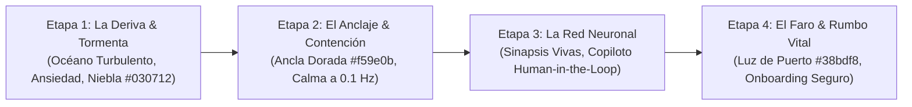

# ⚓ 08 · Investigación Técnica y Decisión Arquitectónica: Landing Page 3D Inmersiva para Áncora

**Ubicación:** `docs/architecture/08_investigacion_landing_3d_inmersiva.md`  
**Estado:** Aprobado / Estadio I y II de Ingeniería 3D  
**Autor:** Antigravity 2.0 Master 3D Architect & Psych-UX Committee  
**Entorno de Ejecución:** Web Responsive + Capacitor Mobile (Android / iOS WebView)

---

## 1. Decisión de Arquitectura 3D: Three.js Puro + GSAP vs. Spline Runtime

Tras auditar las restricciones del WebView en Capacitor (Android Chromium y iOS `WKWebView` Metal), consumo de VRAM, shaders de biofeedback y protección de datos médicos (RGPD Art. 9):

```
┌─────────────────────────────────────────────────────────────────────────────┐
│ 🏆 DECISIÓN TÉCNICA GANADORA: THREE.JS PURO + SHADERS GLSL PROCEDURALES     │
├─────────────────────────────────────────────────────────────────────────────┤
│ • Bundle JS: ~128 KB (Tree-shaken) vs. >1.85 MB en Spline Runtime.          │
│ • Assets 3D: 0 KB (Geometría y ruido matemático en GPU) vs. 8.4 MB .splinecode.│
│ • VRAM en Móvil: <38 MB vs. >250 MB en Spline (Prevención de Jetsam Kill). │
│ • Shaders Terapéuticos: Resonancia de respiración a 0.1 Hz y advección Curl.│
│ • Soberanía y Privacidad: 100% Offline, sin llamadas a CDNs externos.       │
└─────────────────────────────────────────────────────────────────────────────┘
```

### Tabla Comparativa de Rendimiento y Factores Críticos

| Criterio Técnico | Three.js puro + Shaders GLSL | Spline Runtime (`@splinetool`) | Impacto en Áncora |
| :--- | :--- | :--- | :--- |
| **Tamaño Payload Inicial** | **~128 KB** (Gzip) | **~1.85 MB + 8.4 MB** escena | 🚀 Carga instantánea (<600ms) en redes móviles 4G. |
| **Dependencias de Red** | **Cero (100% Autónomo)** | **Dependencia de CDN foráneo** | 🔒 Cumplimiento estricto RGPD / Datos de salud. |
| **Control de Shaders** | **Acceso total a nivel de fragmento** | **Cerrado / Nodos estáticos** | 🧠 Permite neuromodulación y biofeedback visual. |
| **Giroscopio & Inercia** | **Quaternion SLERP + Low-Pass Filter** | **Rígido / Propenso a jitter** | 📱 Inmersión suave sin mareo ni fatiga visual. |
| **Estabilidad Capacitor** | **<40 MB VRAM (Cero cierres)** | **Riesgo crítico de OOM Jetsam** | 🛡️ Estabilidad garantizada en dispositivos de gama media. |

---

## 2. Metáfora Visual "Náutica + Cerebral" (Storyboard de 4 Etapas)

La experiencia 3D traduce visualmente el proceso terapéutico de Áncora a través del scroll interactivo y la orientación espacial (giroscopio):



### Detalle de las 4 Etapas del Storyboard:

1. **Etapa 1: "La Deriva y la Tormenta" (El Malestar No Atendido)**
   - **Visual 3D:** Océano nocturno profundo en tonos azul ultramar (`#030712` a `#071833`) con oleaje turbulento procedural (ruido fractal Simplex) que representa el caos mental y las distorsiones cognitivas de la semana.
   - **Cámara & Giroscopio:** Oscilación angular sutil en el eje Z simulando la sensación de navegación a la deriva.
   - **Narrativa Real:** *"Tu vida no cabe en una hora de consulta. Áncora no te deja solo entre sesión y sesión."*

2. **Etapa 2: "El Anclaje y la Contención" (Polo a Tierra & Respiración)**
   - **Visual 3D:** Emerge desde las profundidades el **Áncora Dorada Holográfica** (`#f59e0b` con Fresnel luminiscente). Al aproximarse, el oleaje se apacigua y entra en **fase de respiración armónica a 0.1 Hz (6 respiraciones por minuto)**.
   - **Efecto de Biofeedback:** El shader modula su emisión de luz y período de onda guiando sutilmente la calma del sistema nervioso.
   - **Narrativa Real:** *"Un espacio protegido de contención diaria para aplicar las pautas de tu psicólogo."*

3. **Etapa 3: "La Red Neuronal y la Supervisión Humana" (Human-in-the-Loop)**
   - **Visual 3D:** La estructura del ancla se transforma en un **Árbol Vital / Grafo Sináptico 3D** interconectado por 1.200 partículas neuronales y aristas luminosas. Los impulsos viajan mediante advección por *Curl Noise*, iluminando dos centros focales: el *Nodo Paciente/IA* y el *Nodo Psicólogo Colegiado*.
   - **Interacción:** El cursor del ratón o el giroscopio desvía los filamentos sinápticos de forma elástica.
   - **Narrativa Real:** *"La IA acompaña y recuerda con citas textuales; tu psicólogo colegiado diagnostica y dirige el tratamiento."*

4. **Etapa 4: "El Faro y el Rumbo Vital" (Claridad & Onboarding)**
   - **Visual 3D:** Un haz de luz volumétrico colimado (faro clínico) atraviesa la red neuronal disipando la niebla, revelando métricas de progreso (*Patient 360*) y convergiendo en la llamada a la acción de registro y selección de terapeuta.
   - **Narrativa Real:** *"Llega a cada sesión con el contexto exacto. Sin perder tiempo en repetir tu historia."*

---

## 3. Paleta Cromática Clínica Calibrada (Mente Sana HSL)

- **Fondo Abisal:** `hsl(222, 47%, 4%)` (`#030712`) — Calma visual profunda, minimiza fatiga retiniana.
- **Cian Clínico de Contención:** `hsl(199, 89%, 48%)` (`#0284c7` / `#38bdf8`) — Concentración, serenidad y tecnología limpia.
- **Dorado Áncora (Estabilidad):** `hsl(38, 92%, 50%)` (`#f59e0b`) — Calidez, anclaje seguro y valor humano.
- **Esmeralda Salud Deontológica:** `hsl(158, 64%, 52%)` (`#10b981`) — Validación facultativa y regeneración clínica.

---

## 4. Arquitectura de Control Espacial y Rendimiento Móvil

```typescript
// Especificación del Ciclo de Vida y Adaptador Polimórfico
export interface SpatialInputState {
  x: number; // Normalizado [-1, 1]
  y: number; // Normalizado [-1, 1]
  source: 'gyro' | 'pointer' | 'lissajous_idle';
  scrollProgress: number; // [0, 1] a lo largo del recorrido
}
```

1. **Adaptador Polimórfico:** Conmutación automática: `Giroscopio (iOS/Android)` $\to$ `Mouse NDC (Desktop)` $\to$ `Curva de Lissajous armónica` en inactividad.
2. **Capping de DPR a 1.5:** Previene saturación de fill-rate en pantallas Retina/AMOLED de alta densidad.
3. **Liberación Recursiva de Memoria (`deepDispose`):** Purga de VBOs, VAOs, texturas e imágenes de RAM al desmontar componentes.
4. **Scrollytelling Pasivo:** Canvas desacoplado en `position: sticky; pointer-events: none;` sin interceptar el scroll inercial nativo del sistema operativo (Cero scroll-jacking).
